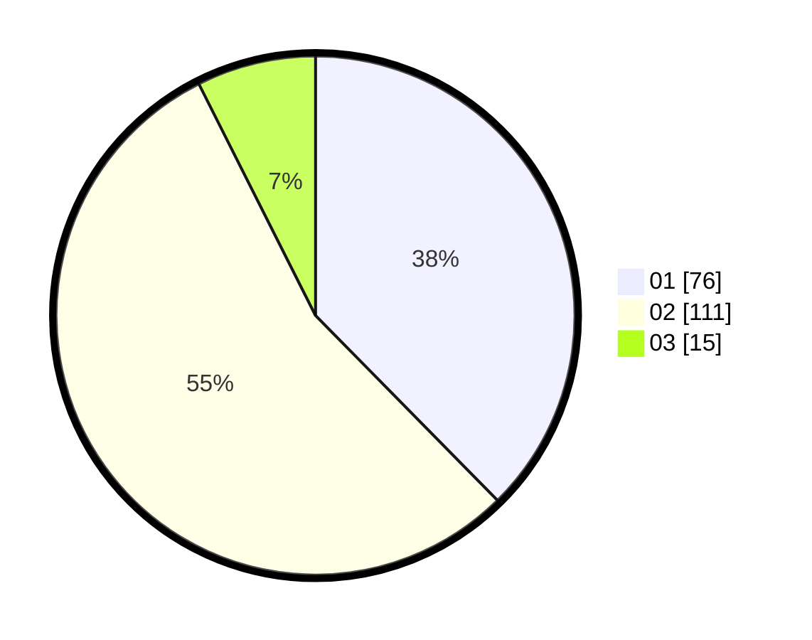

# Hasil

Hasil perolehan suara paslon dapat dilihat pada file paslon-01.txt, paslon-02.txt, dan paslon-03.txt.

Jika tidak ada, artinya data tersebut belum ada pada SIREKAP.

## Perolehan Suara

 * Paslon 01: **76**.
 * Paslon 02: **111**.
 * Paslon 03: **15**.

## Foto C Plano

https://sirekap-obj-formc.kpu.go.id/709a/pemilu/ppwp/31/75/06/10/04/3175061004139-20240214-162225--614324f8-955b-455d-87c5-c3ea1526694d.jpg

https://sirekap-obj-formc.kpu.go.id/709a/pemilu/ppwp/31/75/06/10/04/3175061004139-20240214-160157--a77c2ebd-d0c1-49c2-a376-2c776792ee06.jpg

https://sirekap-obj-formc.kpu.go.id/709a/pemilu/ppwp/31/75/06/10/04/3175061004139-20240214-162231--dbe43a76-2cd9-4599-bc4f-9f1a6e04395d.jpg

## DATA PEMILIH TETAP

Jumlah pemilih dalam DPT: **265**.
 * L: **131**.
 * P: **134**.

## DATA PENGGUNA HAK PILIH

Jumlah pengguna hak pilih dalam DPT: **221**.
 * L: **101**.
 * P: **120**.

Jumlah pengguna hak pilih dalam DPTb: **0**.
 * L: **0**.
 * P: **0**.

Jumlah pengguna hak pilih dalam DPK: **0**.
 * L: **0**.
 * P: **0**.

Jumlah pengguna hak pilih: **221**.
 * L: **101**.
 * P: **120**.

## JUMLAH SUARA SAH DAN TIDAK SAH

JUMLAH SELURUH SUARA SAH: **202**.

JUMLAH SUARA TIDAK SAH: **20**.

JUMLAH SELURUH SUARA SAH DAN SUARA TIDAK SAH: **222**.
