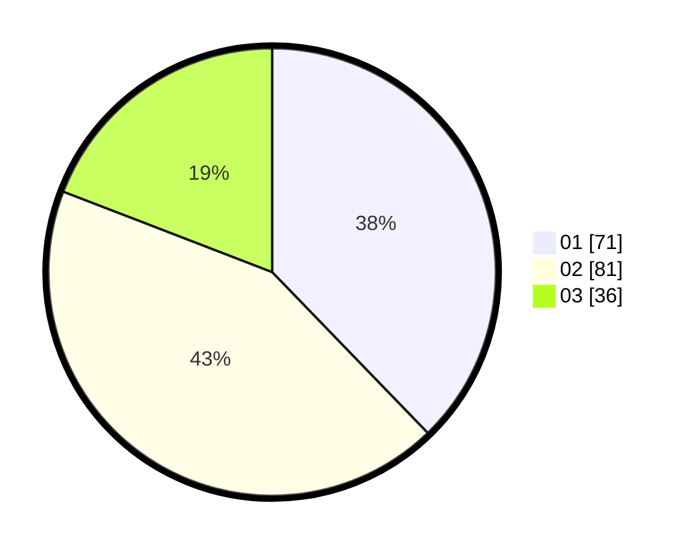

# Hasil

Hasil perolehan suara paslon dapat dilihat pada file paslon-01.txt, paslon-02.txt, dan paslon-03.txt.

Jika tidak ada, artinya data tersebut belum ada pada SIREKAP.

## Perolehan Suara

 * Paslon 01: **71**.
 * Paslon 02: **81**.
 * Paslon 03: **36**.

## Foto C Plano

https://sirekap-obj-formc.kpu.go.id/8294/pemilu/ppwp/31/75/06/10/04/3175061004147-20240214-200623--eee07349-1b6c-4325-aa8a-14faaa5029bc.jpg

https://sirekap-obj-formc.kpu.go.id/8294/pemilu/ppwp/31/75/06/10/04/3175061004147-20240214-200705--ff6abb72-67af-4e80-92da-f98b1adf3380.jpg

https://sirekap-obj-formc.kpu.go.id/8294/pemilu/ppwp/31/75/06/10/04/3175061004147-20240214-200804--cb67a28b-6190-4263-9f44-3445b1e6d91c.jpg

## DATA PEMILIH TETAP

Jumlah pemilih dalam DPT: **239**.
 * L: **128**.
 * P: **111**.

## DATA PENGGUNA HAK PILIH

Jumlah pengguna hak pilih dalam DPT: **189**.
 * L: **93**.
 * P: **96**.

Jumlah pengguna hak pilih dalam DPTb: **0**.
 * L: **0**.
 * P: **0**.

Jumlah pengguna hak pilih dalam DPK: **1**.
 * L: **0**.
 * P: **1**.

Jumlah pengguna hak pilih: **190**.
 * L: **93**.
 * P: **97**.

## JUMLAH SUARA SAH DAN TIDAK SAH

JUMLAH SELURUH SUARA SAH: **188**.

JUMLAH SUARA TIDAK SAH: **2**.

JUMLAH SELURUH SUARA SAH DAN SUARA TIDAK SAH: **190**.
