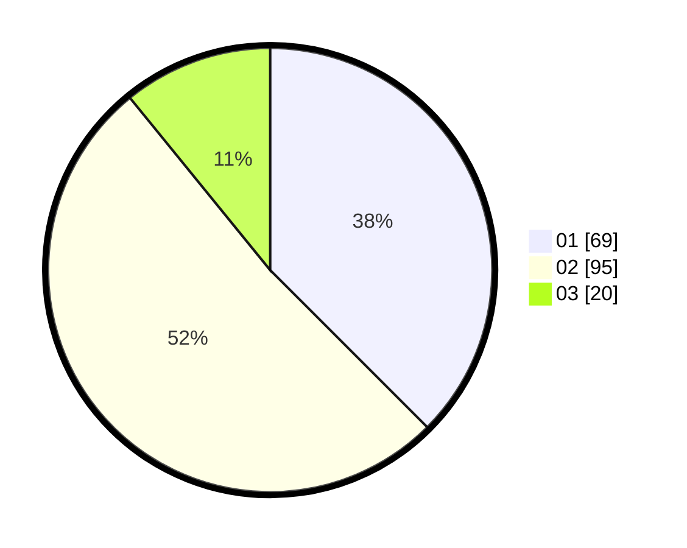

# Hasil

Hasil perolehan suara paslon dapat dilihat pada file paslon-01.txt, paslon-02.txt, dan paslon-03.txt.

Jika tidak ada, artinya data tersebut belum ada pada SIREKAP.

## Perolehan Suara

 * Paslon 01: **69**.
 * Paslon 02: **95**.
 * Paslon 03: **20**.

## Foto C Plano

https://sirekap-obj-formc.kpu.go.id/2eb0/pemilu/ppwp/31/75/06/10/04/3175061004183-20240215-015947--004311e4-3c77-4183-9f51-2e48197f59ee.jpg

https://sirekap-obj-formc.kpu.go.id/2eb0/pemilu/ppwp/31/75/06/10/04/3175061004183-20240214-194308--794dfe35-13f1-4b52-9e68-b6d1f6397a15.jpg

https://sirekap-obj-formc.kpu.go.id/2eb0/pemilu/ppwp/31/75/06/10/04/3175061004183-20240215-020102--5c657b86-51de-4a77-be65-40dc6d87d404.jpg
