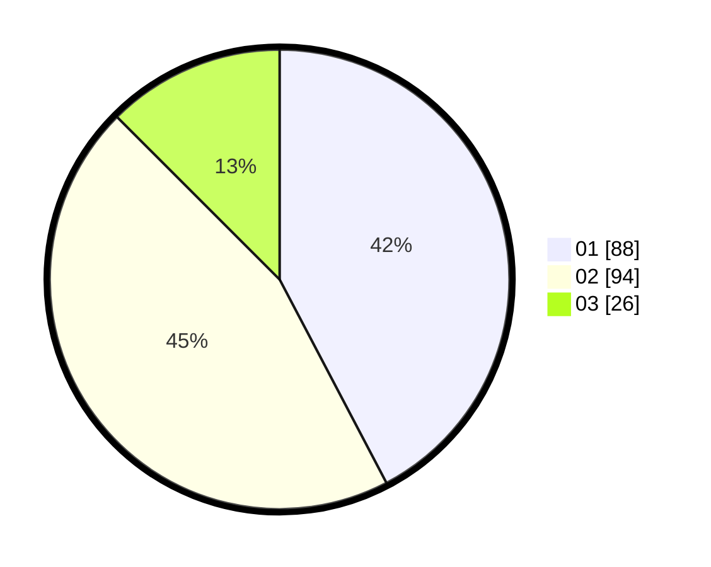

# Hasil

Hasil perolehan suara paslon dapat dilihat pada file paslon-01.txt, paslon-02.txt, dan paslon-03.txt.

Jika tidak ada, artinya data tersebut belum ada pada SIREKAP.

## Perolehan Suara

 * Paslon 01: **88**.
 * Paslon 02: **94**.
 * Paslon 03: **26**.

## Foto C Plano

https://sirekap-obj-formc.kpu.go.id/f719/pemilu/ppwp/31/75/06/10/04/3175061004189-20240214-191607--b66a403a-057a-4b76-913f-997b39187b84.jpg

https://sirekap-obj-formc.kpu.go.id/f719/pemilu/ppwp/31/75/06/10/04/3175061004189-20240214-191644--081d3bbe-cfec-4657-9b29-aaeefe678089.jpg

https://sirekap-obj-formc.kpu.go.id/f719/pemilu/ppwp/31/75/06/10/04/3175061004189-20240214-191713--51053b9c-761f-4470-b0b1-5d0613ba8941.jpg

## DATA PEMILIH TETAP

Jumlah pemilih dalam DPT: **266**.
 * L: **122**.
 * P: **144**.

## DATA PENGGUNA HAK PILIH

Jumlah pengguna hak pilih dalam DPT: **210**.
 * L: **98**.
 * P: **112**.

Jumlah pengguna hak pilih dalam DPTb: **1**.
 * L: **1**.
 * P: **0**.

Jumlah pengguna hak pilih dalam DPK: **2**.
 * L: **2**.
 * P: **0**.

Jumlah pengguna hak pilih: **213**.
 * L: **101**.
 * P: **112**.

## JUMLAH SUARA SAH DAN TIDAK SAH

JUMLAH SELURUH SUARA SAH: **208**.

JUMLAH SUARA TIDAK SAH: **5**.

JUMLAH SELURUH SUARA SAH DAN SUARA TIDAK SAH: **213**.
