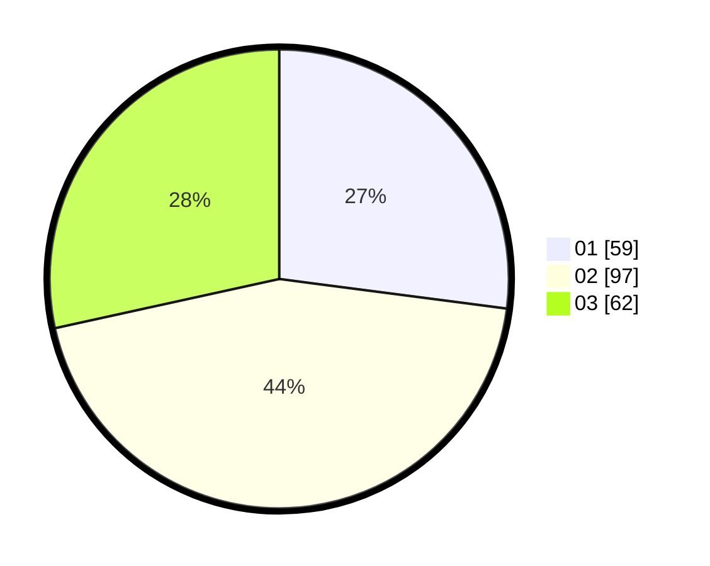

# Hasil

Hasil perolehan suara paslon dapat dilihat pada file paslon-01.txt, paslon-02.txt, dan paslon-03.txt.

Jika tidak ada, artinya data tersebut belum ada pada SIREKAP.

## Perolehan Suara

 * Paslon 01: **59**.
 * Paslon 02: **97**.
 * Paslon 03: **62**.

## Foto C Plano

https://sirekap-obj-formc.kpu.go.id/0cf9/pemilu/ppwp/31/75/06/10/04/3175061004195-20240215-102356--eed276a4-684d-42cf-a863-8ce492967778.jpg

https://sirekap-obj-formc.kpu.go.id/0cf9/pemilu/ppwp/31/75/06/10/04/3175061004195-20240215-102418--42f5f962-ea42-4412-bd3e-4eac95e33a45.jpg

https://sirekap-obj-formc.kpu.go.id/0cf9/pemilu/ppwp/31/75/06/10/04/3175061004195-20240215-102407--8911d41a-5d62-4c3f-99e9-ee1b2d7e7797.jpg

## DATA PEMILIH TETAP

Jumlah pemilih dalam DPT: **277**.
 * L: **135**.
 * P: **142**.

## DATA PENGGUNA HAK PILIH

Jumlah pengguna hak pilih dalam DPT: **213**.
 * L: **103**.
 * P: **110**.

Jumlah pengguna hak pilih dalam DPTb: **1**.
 * L: **0**.
 * P: **1**.

Jumlah pengguna hak pilih dalam DPK: **5**.
 * L: **3**.
 * P: **2**.

Jumlah pengguna hak pilih: **219**.
 * L: **106**.
 * P: **113**.

## JUMLAH SUARA SAH DAN TIDAK SAH

JUMLAH SELURUH SUARA SAH: **218**.

JUMLAH SUARA TIDAK SAH: **1**.

JUMLAH SELURUH SUARA SAH DAN SUARA TIDAK SAH: **219**.
