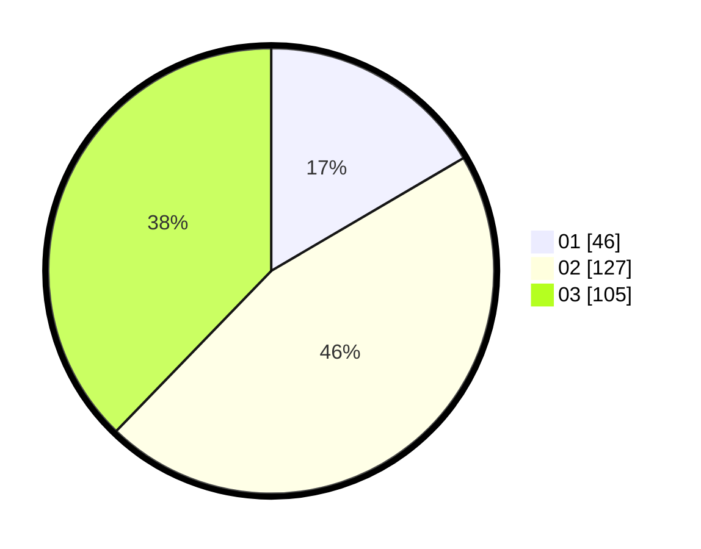

# Hasil

Hasil perolehan suara paslon dapat dilihat pada file paslon-01.txt, paslon-02.txt, dan paslon-03.txt.

Jika tidak ada, artinya data tersebut belum ada pada SIREKAP.

## Perolehan Suara

 * Paslon 01: **46**.
 * Paslon 02: **127**.
 * Paslon 03: **105**.

## Foto C Plano

https://sirekap-obj-formc.kpu.go.id/00dd/pemilu/ppwp/31/75/06/10/04/3175061004205-20240214-155339--cd89d1e7-9807-4553-a51f-f0f6899bbd09.jpg

https://sirekap-obj-formc.kpu.go.id/00dd/pemilu/ppwp/31/75/06/10/04/3175061004205-20240214-155447--ba0a1b9b-c7a6-4c5d-88b0-d3ee11ae393e.jpg

https://sirekap-obj-formc.kpu.go.id/00dd/pemilu/ppwp/31/75/06/10/04/3175061004205-20240214-155522--b86e213e-776d-4857-96b2-f2eabe0d7d04.jpg

## DATA PEMILIH TETAP

Jumlah pemilih dalam DPT: **283**.
 * L: **133**.
 * P: **150**.

## DATA PENGGUNA HAK PILIH

Jumlah pengguna hak pilih dalam DPT: **242**.
 * L: **113**.
 * P: **129**.

Jumlah pengguna hak pilih dalam DPTb: **16**.
 * L: **9**.
 * P: **7**.

Jumlah pengguna hak pilih dalam DPK: **23**.
 * L: **11**.
 * P: **12**.

Jumlah pengguna hak pilih: **281**.
 * L: **133**.
 * P: **148**.

## JUMLAH SUARA SAH DAN TIDAK SAH

JUMLAH SELURUH SUARA SAH: **278**.

JUMLAH SUARA TIDAK SAH: **3**.

JUMLAH SELURUH SUARA SAH DAN SUARA TIDAK SAH: **281**.
