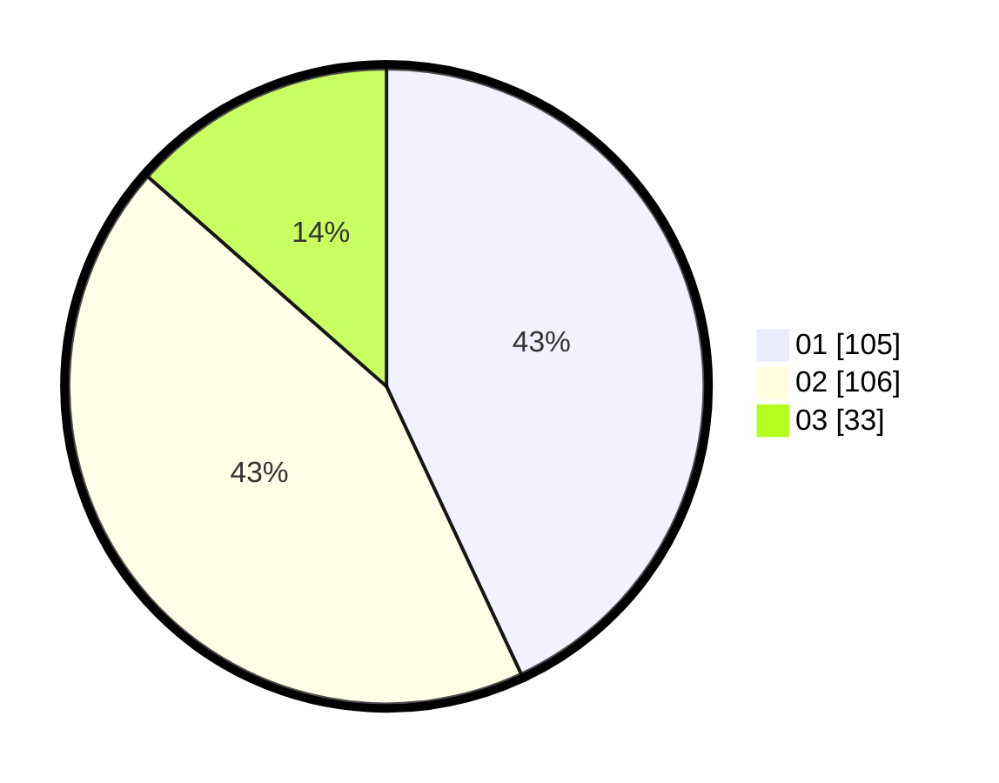

# Hasil

Hasil perolehan suara paslon dapat dilihat pada file paslon-01.txt, paslon-02.txt, dan paslon-03.txt.

Jika tidak ada, artinya data tersebut belum ada pada SIREKAP.

## Perolehan Suara

 * Paslon 01: **105**.
 * Paslon 02: **106**.
 * Paslon 03: **33**.

## Foto C Plano

https://sirekap-obj-formc.kpu.go.id/4984/pemilu/ppwp/31/75/06/10/05/3175061005006-20240214-200648--13e7de50-7497-4174-ab5d-ddd1d85dc591.jpg

https://sirekap-obj-formc.kpu.go.id/4984/pemilu/ppwp/31/75/06/10/05/3175061005006-20240214-200710--26cd9913-cbb1-4554-b351-960aa40be7b0.jpg

https://sirekap-obj-formc.kpu.go.id/4984/pemilu/ppwp/31/75/06/10/05/3175061005006-20240214-200659--b8501eef-74bb-4d2d-b815-942a4e3123c1.jpg

## DATA PEMILIH TETAP

Jumlah pemilih dalam DPT: **296**.
 * L: **143**.
 * P: **153**.

## DATA PENGGUNA HAK PILIH

Jumlah pengguna hak pilih dalam DPT: **241**.
 * L: **113**.
 * P: **128**.

Jumlah pengguna hak pilih dalam DPTb: **5**.
 * L: **3**.
 * P: **2**.

Jumlah pengguna hak pilih dalam DPK: **0**.
 * L: **0**.
 * P: **0**.

Jumlah pengguna hak pilih: **246**.
 * L: **116**.
 * P: **130**.

## JUMLAH SUARA SAH DAN TIDAK SAH

JUMLAH SELURUH SUARA SAH: **244**.

JUMLAH SUARA TIDAK SAH: **2**.

JUMLAH SELURUH SUARA SAH DAN SUARA TIDAK SAH: **246**.
