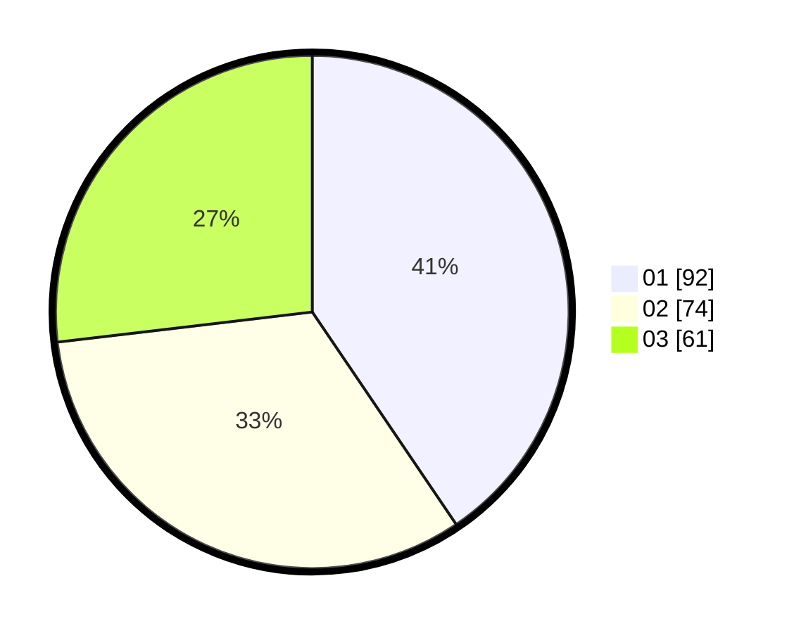

# Hasil

Hasil perolehan suara paslon dapat dilihat pada file paslon-01.txt, paslon-02.txt, dan paslon-03.txt.

Jika tidak ada, artinya data tersebut belum ada pada SIREKAP.

## Perolehan Suara

 * Paslon 01: **92**.
 * Paslon 02: **74**.
 * Paslon 03: **61**.

## Foto C Plano

https://sirekap-obj-formc.kpu.go.id/533b/pemilu/ppwp/31/75/06/10/05/3175061005007-20240214-155238--f8de42e5-93a9-4db4-bb7c-994bbb63200c.jpg

https://sirekap-obj-formc.kpu.go.id/533b/pemilu/ppwp/31/75/06/10/05/3175061005007-20240214-155331--f4596193-0653-40cc-b29c-d5cf7c3dc672.jpg

https://sirekap-obj-formc.kpu.go.id/533b/pemilu/ppwp/31/75/06/10/05/3175061005007-20240214-155356--1645f740-642f-40f2-bf5a-c232cebc6ebf.jpg

## DATA PEMILIH TETAP

Jumlah pemilih dalam DPT: **293**.
 * L: **155**.
 * P: **138**.

## DATA PENGGUNA HAK PILIH

Jumlah pengguna hak pilih dalam DPT: **228**.
 * L: **117**.
 * P: **111**.

Jumlah pengguna hak pilih dalam DPTb: **0**.
 * L: **0**.
 * P: **0**.

Jumlah pengguna hak pilih dalam DPK: **3**.
 * L: **2**.
 * P: **1**.

Jumlah pengguna hak pilih: **231**.
 * L: **119**.
 * P: **112**.

## JUMLAH SUARA SAH DAN TIDAK SAH

JUMLAH SELURUH SUARA SAH: **227**.

JUMLAH SUARA TIDAK SAH: **4**.

JUMLAH SELURUH SUARA SAH DAN SUARA TIDAK SAH: **231**.
