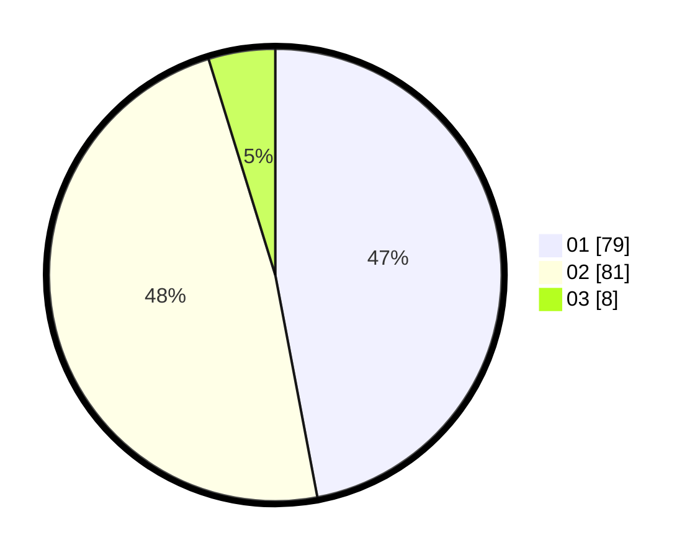

# Hasil

Hasil perolehan suara paslon dapat dilihat pada file paslon-01.txt, paslon-02.txt, dan paslon-03.txt.

Jika tidak ada, artinya data tersebut belum ada pada SIREKAP.

## Perolehan Suara

 * Paslon 01: **79**.
 * Paslon 02: **81**.
 * Paslon 03: **8**.

## Foto C Plano

https://sirekap-obj-formc.kpu.go.id/9824/pemilu/ppwp/31/75/06/10/05/3175061005009-20240216-005525--baa4b7a0-3de0-4409-a002-6d18cd2bdf7a.jpg

https://sirekap-obj-formc.kpu.go.id/9824/pemilu/ppwp/31/75/06/10/05/3175061005009-20240215-202945--225306ab-cea2-40ed-b951-521af1118844.jpg

https://sirekap-obj-formc.kpu.go.id/9824/pemilu/ppwp/31/75/06/10/05/3175061005009-20240215-202938--2d8e2a06-3547-4216-a9be-051aa3ea4c62.jpg

## DATA PEMILIH TETAP

Jumlah pemilih dalam DPT: **243**.
 * L: **126**.
 * P: **117**.

## DATA PENGGUNA HAK PILIH

Jumlah pengguna hak pilih dalam DPT: **171**.
 * L: **85**.
 * P: **86**.

Jumlah pengguna hak pilih dalam DPTb: **0**.
 * L: **0**.
 * P: **0**.

Jumlah pengguna hak pilih dalam DPK: **0**.
 * L: **0**.
 * P: **0**.

Jumlah pengguna hak pilih: **171**.
 * L: **85**.
 * P: **86**.

## JUMLAH SUARA SAH DAN TIDAK SAH

JUMLAH SELURUH SUARA SAH: **168**.

JUMLAH SUARA TIDAK SAH: **3**.

JUMLAH SELURUH SUARA SAH DAN SUARA TIDAK SAH: **171**.
