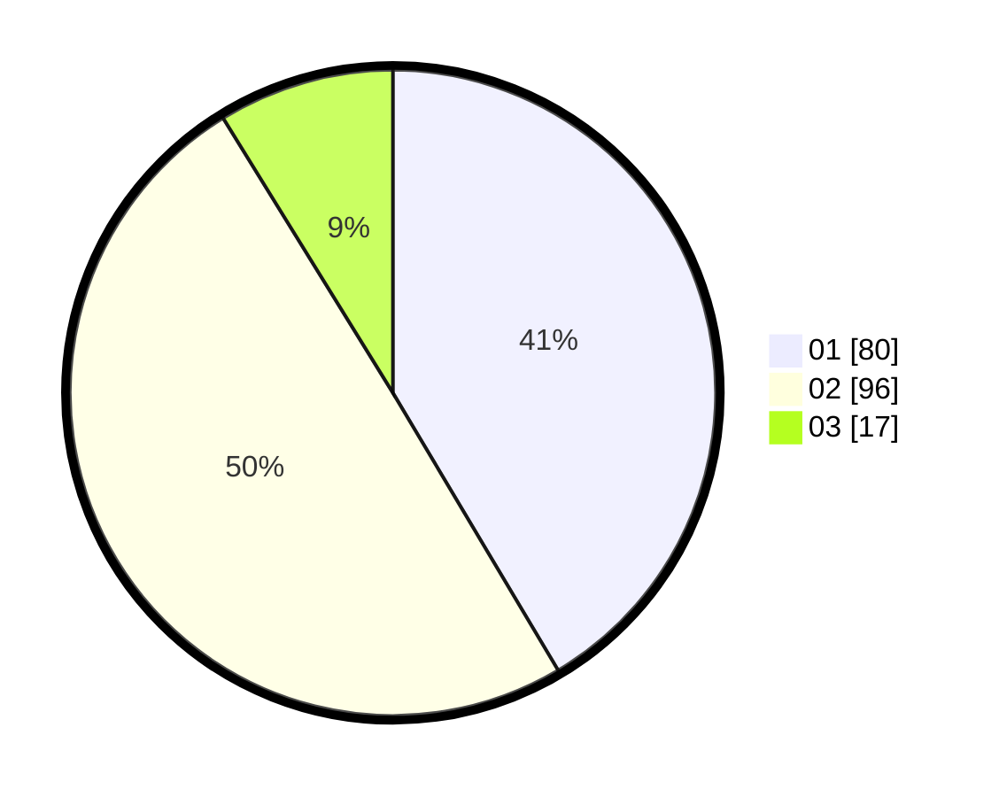

# Hasil

Hasil perolehan suara paslon dapat dilihat pada file paslon-01.txt, paslon-02.txt, dan paslon-03.txt.

Jika tidak ada, artinya data tersebut belum ada pada SIREKAP.

## Perolehan Suara

 * Paslon 01: **80**.
 * Paslon 02: **96**.
 * Paslon 03: **17**.

## Foto C Plano

https://sirekap-obj-formc.kpu.go.id/73bc/pemilu/ppwp/31/75/06/10/05/3175061005011-20240215-052856--33542314-00a7-4716-9ce6-66d4915829fc.jpg

https://sirekap-obj-formc.kpu.go.id/73bc/pemilu/ppwp/31/75/06/10/05/3175061005011-20240215-052924--8dfbf0ae-21c5-4ad1-b9f5-d52aa41963c9.jpg

https://sirekap-obj-formc.kpu.go.id/73bc/pemilu/ppwp/31/75/06/10/05/3175061005011-20240215-052914--e3b4e7e1-8019-4389-b2d0-8fa8d2d7b45d.jpg

## DATA PEMILIH TETAP

Jumlah pemilih dalam DPT: **243**.
 * L: **122**.
 * P: **121**.

## DATA PENGGUNA HAK PILIH

Jumlah pengguna hak pilih dalam DPT: **195**.
 * L: **96**.
 * P: **99**.

Jumlah pengguna hak pilih dalam DPTb: **0**.
 * L: **0**.
 * P: **0**.

Jumlah pengguna hak pilih dalam DPK: **0**.
 * L: **0**.
 * P: **0**.

Jumlah pengguna hak pilih: **195**.
 * L: **96**.
 * P: **99**.

## JUMLAH SUARA SAH DAN TIDAK SAH

JUMLAH SELURUH SUARA SAH: **193**.

JUMLAH SUARA TIDAK SAH: **2**.

JUMLAH SELURUH SUARA SAH DAN SUARA TIDAK SAH: **195**.
