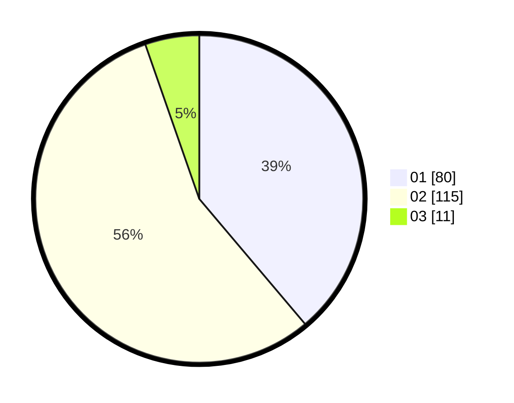

# Hasil

Hasil perolehan suara paslon dapat dilihat pada file paslon-01.txt, paslon-02.txt, dan paslon-03.txt.

Jika tidak ada, artinya data tersebut belum ada pada SIREKAP.

## Perolehan Suara

 * Paslon 01: **80**.
 * Paslon 02: **115**.
 * Paslon 03: **11**.

## Foto C Plano

https://sirekap-obj-formc.kpu.go.id/ae44/pemilu/ppwp/31/75/06/10/05/3175061005014-20240214-191642--4019c7e3-e4ae-4772-aa0c-8ce6271c1d23.jpg

https://sirekap-obj-formc.kpu.go.id/ae44/pemilu/ppwp/31/75/06/10/05/3175061005014-20240214-184649--18805a07-e421-4066-b454-e3a425a8dc36.jpg

https://sirekap-obj-formc.kpu.go.id/ae44/pemilu/ppwp/31/75/06/10/05/3175061005014-20240214-184814--5a1327e6-4663-4dc7-88c7-8c129b4a5957.jpg
