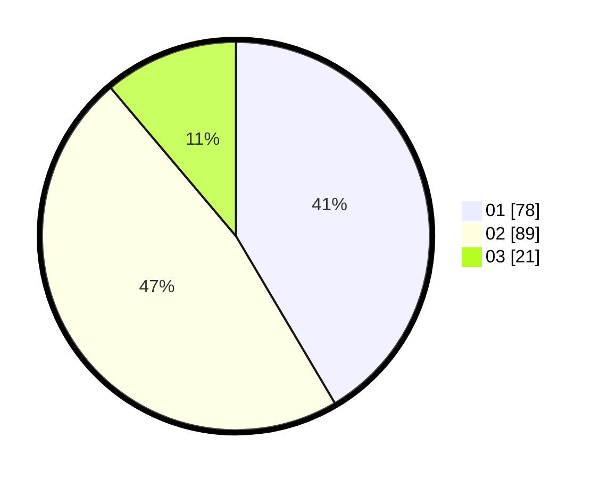

# Hasil

Hasil perolehan suara paslon dapat dilihat pada file paslon-01.txt, paslon-02.txt, dan paslon-03.txt.

Jika tidak ada, artinya data tersebut belum ada pada SIREKAP.

## Perolehan Suara

 * Paslon 01: **78**.
 * Paslon 02: **89**.
 * Paslon 03: **21**.

## Foto C Plano

https://sirekap-obj-formc.kpu.go.id/23bb/pemilu/ppwp/31/75/06/10/05/3175061005021-20240214-155444--22c34bbd-1bf3-4c28-b5cc-777d2c134f2a.jpg

https://sirekap-obj-formc.kpu.go.id/23bb/pemilu/ppwp/31/75/06/10/05/3175061005021-20240214-213148--934ff7cf-07f4-48fc-9f0e-ed5327f83447.jpg

https://sirekap-obj-formc.kpu.go.id/23bb/pemilu/ppwp/31/75/06/10/05/3175061005021-20240214-213215--ce6215d6-a943-475b-908f-4c8356fa4625.jpg

## DATA PEMILIH TETAP

Jumlah pemilih dalam DPT: **255**.
 * L: **126**.
 * P: **129**.

## DATA PENGGUNA HAK PILIH

Jumlah pengguna hak pilih dalam DPT: **185**.
 * L: **90**.
 * P: **95**.

Jumlah pengguna hak pilih dalam DPTb: **2**.
 * L: **1**.
 * P: **1**.

Jumlah pengguna hak pilih dalam DPK: **3**.
 * L: **0**.
 * P: **3**.

Jumlah pengguna hak pilih: **190**.
 * L: **91**.
 * P: **99**.

## JUMLAH SUARA SAH DAN TIDAK SAH

JUMLAH SELURUH SUARA SAH: **188**.

JUMLAH SUARA TIDAK SAH: **2**.

JUMLAH SELURUH SUARA SAH DAN SUARA TIDAK SAH: **190**.
