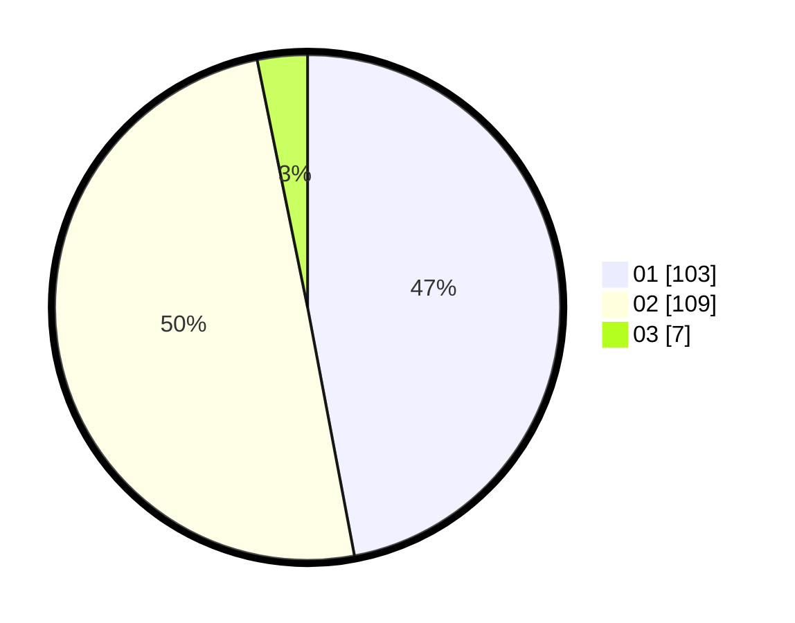

# Hasil

Hasil perolehan suara paslon dapat dilihat pada file paslon-01.txt, paslon-02.txt, dan paslon-03.txt.

Jika tidak ada, artinya data tersebut belum ada pada SIREKAP.

## Perolehan Suara

 * Paslon 01: **103**.
 * Paslon 02: **109**.
 * Paslon 03: **7**.

## Foto C Plano

https://sirekap-obj-formc.kpu.go.id/8698/pemilu/ppwp/31/75/06/10/05/3175061005025-20240215-002819--4b0f722b-4103-40da-ad09-f871bb105e5d.jpg

https://sirekap-obj-formc.kpu.go.id/8698/pemilu/ppwp/31/75/06/10/05/3175061005025-20240215-000744--30c55e62-67da-4a6a-a8db-359197f86603.jpg

https://sirekap-obj-formc.kpu.go.id/8698/pemilu/ppwp/31/75/06/10/05/3175061005025-20240215-000849--d3e68e24-b0c5-4b85-8c62-58c8a0c03fd6.jpg
