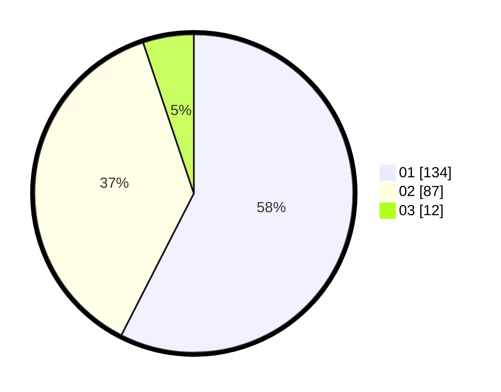

# Hasil

Hasil perolehan suara paslon dapat dilihat pada file paslon-01.txt, paslon-02.txt, dan paslon-03.txt.

Jika tidak ada, artinya data tersebut belum ada pada SIREKAP.

## Perolehan Suara

 * Paslon 01: **134**.
 * Paslon 02: **87**.
 * Paslon 03: **12**.

## Foto C Plano

https://sirekap-obj-formc.kpu.go.id/d02d/pemilu/ppwp/31/75/06/10/05/3175061005031-20240215-013104--42a29dbb-22f6-4c44-8ab0-c0b24eea34da.jpg

https://sirekap-obj-formc.kpu.go.id/d02d/pemilu/ppwp/31/75/06/10/05/3175061005031-20240215-013146--bb796693-94b2-45c9-9e0e-cddae7c488a9.jpg

https://sirekap-obj-formc.kpu.go.id/d02d/pemilu/ppwp/31/75/06/10/05/3175061005031-20240215-013232--e39bab01-eb6a-4b8c-816b-b605c0672573.jpg
