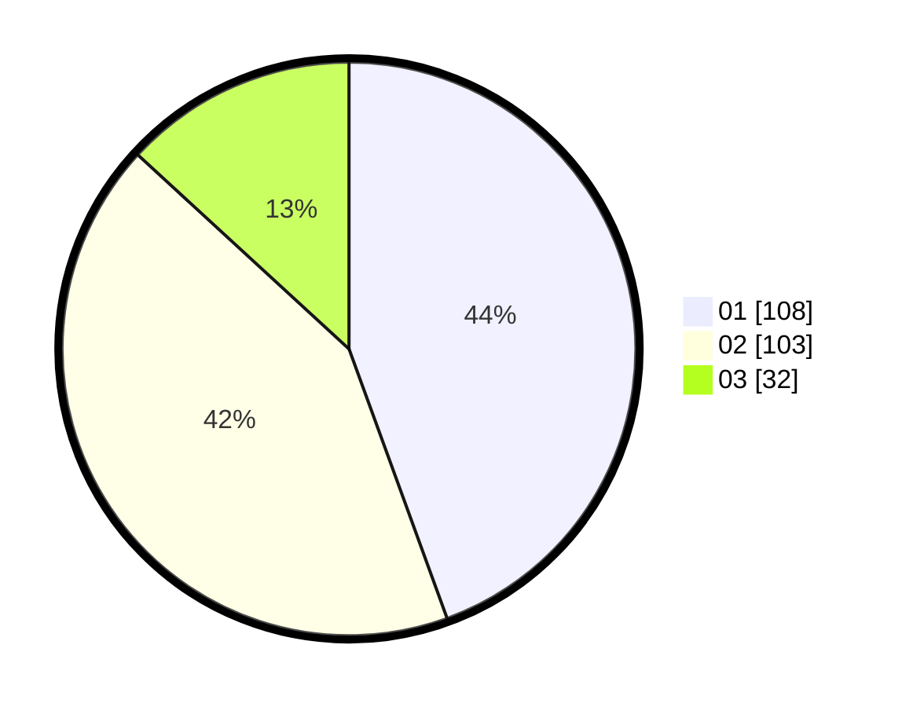

# Hasil

Hasil perolehan suara paslon dapat dilihat pada file paslon-01.txt, paslon-02.txt, dan paslon-03.txt.

Jika tidak ada, artinya data tersebut belum ada pada SIREKAP.

## Perolehan Suara

 * Paslon 01: **108**.
 * Paslon 02: **103**.
 * Paslon 03: **32**.

## Foto C Plano

https://sirekap-obj-formc.kpu.go.id/1ceb/pemilu/ppwp/31/75/06/10/05/3175061005048-20240214-235046--9a83b856-7d4e-4f6a-bae3-de61a24c31bb.jpg

https://sirekap-obj-formc.kpu.go.id/1ceb/pemilu/ppwp/31/75/06/10/05/3175061005048-20240214-235243--fe5a7a49-99c3-47bb-af8b-1617e65a563e.jpg

https://sirekap-obj-formc.kpu.go.id/1ceb/pemilu/ppwp/31/75/06/10/05/3175061005048-20240214-235333--fb8512d3-d700-41c4-9fc9-0b2f40c86f56.jpg
