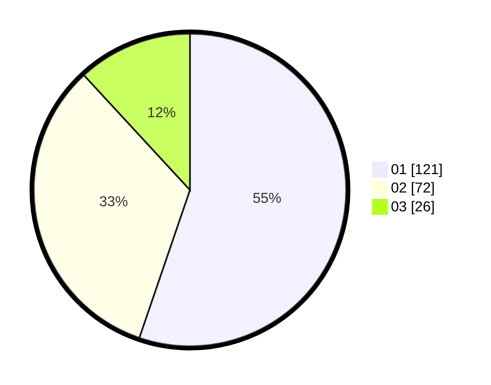

# Hasil

Hasil perolehan suara paslon dapat dilihat pada file paslon-01.txt, paslon-02.txt, dan paslon-03.txt.

Jika tidak ada, artinya data tersebut belum ada pada SIREKAP.

## Perolehan Suara

 * Paslon 01: **121**.
 * Paslon 02: **72**.
 * Paslon 03: **26**.

## Foto C Plano

https://sirekap-obj-formc.kpu.go.id/cf91/pemilu/ppwp/31/75/06/10/05/3175061005049-20240214-231816--6f66db29-eb1c-43d0-b179-d87853ad8d48.jpg

https://sirekap-obj-formc.kpu.go.id/cf91/pemilu/ppwp/31/75/06/10/05/3175061005049-20240214-184511--39738c00-ee2f-4353-8c81-7affd9a44548.jpg

https://sirekap-obj-formc.kpu.go.id/cf91/pemilu/ppwp/31/75/06/10/05/3175061005049-20240214-184950--a7049ac2-bb43-43a8-afee-4a735422300e.jpg
