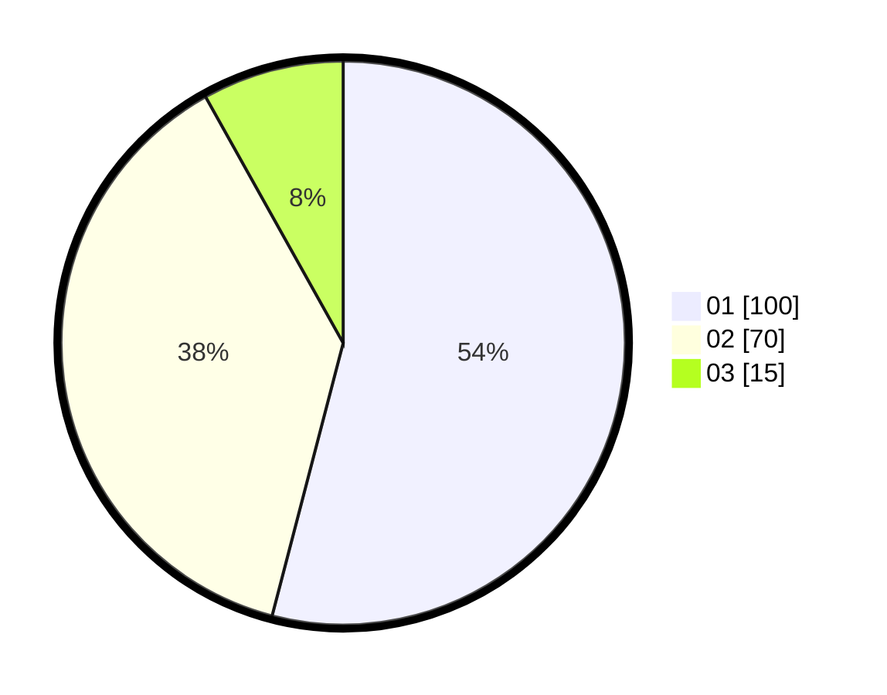

# Hasil

Hasil perolehan suara paslon dapat dilihat pada file paslon-01.txt, paslon-02.txt, dan paslon-03.txt.

Jika tidak ada, artinya data tersebut belum ada pada SIREKAP.

## Perolehan Suara

 * Paslon 01: **100**.
 * Paslon 02: **70**.
 * Paslon 03: **15**.

## Foto C Plano

https://sirekap-obj-formc.kpu.go.id/3c02/pemilu/ppwp/31/75/06/10/05/3175061005058-20240214-224416--847648f6-3156-4625-9670-94079c94285c.jpg

https://sirekap-obj-formc.kpu.go.id/3c02/pemilu/ppwp/31/75/06/10/05/3175061005058-20240214-224642--511d87ed-5a51-4940-9cdb-f1e8badf47b5.jpg

https://sirekap-obj-formc.kpu.go.id/3c02/pemilu/ppwp/31/75/06/10/05/3175061005058-20240214-225250--04c10461-fd8a-4c9b-acbc-3265e12c1417.jpg
