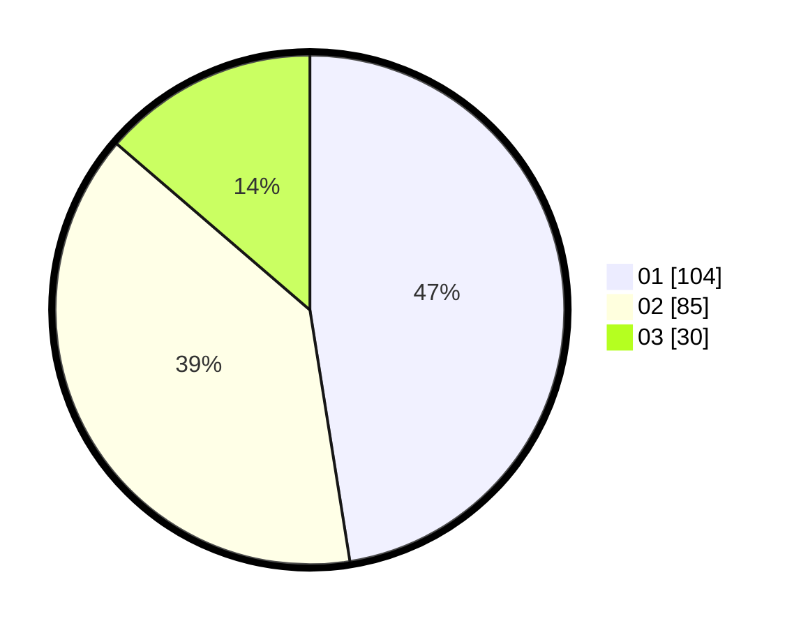

# Hasil

Hasil perolehan suara paslon dapat dilihat pada file paslon-01.txt, paslon-02.txt, dan paslon-03.txt.

Jika tidak ada, artinya data tersebut belum ada pada SIREKAP.

## Perolehan Suara

 * Paslon 01: **104**.
 * Paslon 02: **85**.
 * Paslon 03: **30**.

## Foto C Plano

https://sirekap-obj-formc.kpu.go.id/d4fa/pemilu/ppwp/31/75/06/10/05/3175061005060-20240214-220825--64cfb6bf-86a0-494a-9aba-61b8c6c98c84.jpg

https://sirekap-obj-formc.kpu.go.id/d4fa/pemilu/ppwp/31/75/06/10/05/3175061005060-20240214-220730--5ef5e8f8-5ff0-4b07-9e43-075c0341568b.jpg

https://sirekap-obj-formc.kpu.go.id/d4fa/pemilu/ppwp/31/75/06/10/05/3175061005060-20240214-220631--aacd7f51-4de6-46b7-8190-235d1bdb10e3.jpg
