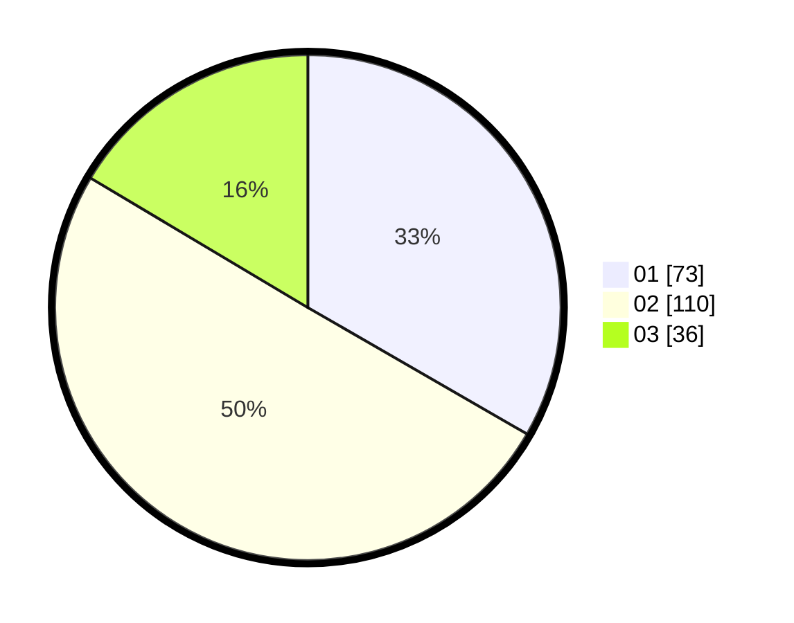

# Hasil

Hasil perolehan suara paslon dapat dilihat pada file paslon-01.txt, paslon-02.txt, dan paslon-03.txt.

Jika tidak ada, artinya data tersebut belum ada pada SIREKAP.

## Perolehan Suara

 * Paslon 01: **73**.
 * Paslon 02: **110**.
 * Paslon 03: **36**.

## Foto C Plano

https://sirekap-obj-formc.kpu.go.id/1937/pemilu/ppwp/31/75/06/10/05/3175061005061-20240214-204333--d89bbbe6-3ef0-4da3-b75b-6efccc10f38f.jpg

https://sirekap-obj-formc.kpu.go.id/1937/pemilu/ppwp/31/75/06/10/05/3175061005061-20240214-232718--71df5860-d778-4657-b18a-3f1542cdd696.jpg

https://sirekap-obj-formc.kpu.go.id/1937/pemilu/ppwp/31/75/06/10/05/3175061005061-20240214-204409--e368347c-6489-403e-93e6-780c6151ad69.jpg

## DATA PEMILIH TETAP

Jumlah pemilih dalam DPT: **274**.
 * L: **130**.
 * P: **144**.

## DATA PENGGUNA HAK PILIH

Jumlah pengguna hak pilih dalam DPT: **219**.
 * L: **101**.
 * P: **118**.

Jumlah pengguna hak pilih dalam DPTb: **3**.
 * L: **1**.
 * P: **2**.

Jumlah pengguna hak pilih dalam DPK: **0**.
 * L: **0**.
 * P: **0**.

Jumlah pengguna hak pilih: **222**.
 * L: **102**.
 * P: **120**.

## JUMLAH SUARA SAH DAN TIDAK SAH

JUMLAH SELURUH SUARA SAH: **219**.

JUMLAH SUARA TIDAK SAH: **3**.

JUMLAH SELURUH SUARA SAH DAN SUARA TIDAK SAH: **222**.
