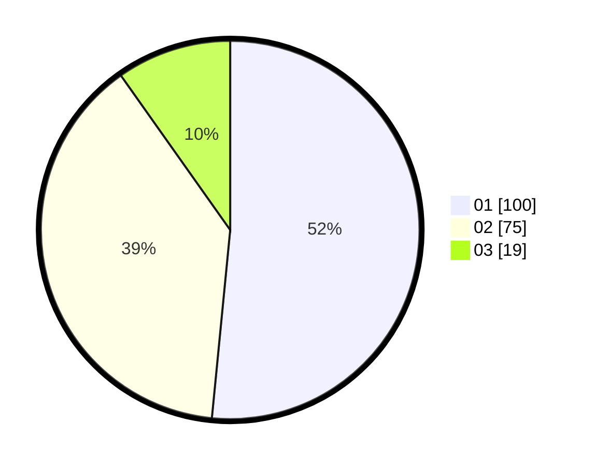

# Hasil

Hasil perolehan suara paslon dapat dilihat pada file paslon-01.txt, paslon-02.txt, dan paslon-03.txt.

Jika tidak ada, artinya data tersebut belum ada pada SIREKAP.

## Perolehan Suara

 * Paslon 01: **100**.
 * Paslon 02: **75**.
 * Paslon 03: **19**.

## Foto C Plano

https://sirekap-obj-formc.kpu.go.id/110f/pemilu/ppwp/31/75/06/10/05/3175061005067-20240214-195539--321a3cdc-ccb4-43cd-b3a0-6b8d9c5d0976.jpg

https://sirekap-obj-formc.kpu.go.id/110f/pemilu/ppwp/31/75/06/10/05/3175061005067-20240214-210550--5796e079-1a40-48c5-85e8-cea412f2a4f1.jpg

https://sirekap-obj-formc.kpu.go.id/110f/pemilu/ppwp/31/75/06/10/05/3175061005067-20240214-195816--92778ed3-f64f-43f3-95f3-2350f7b53dfe.jpg

## DATA PEMILIH TETAP

Jumlah pemilih dalam DPT: **275**.
 * L: **140**.
 * P: **135**.

## DATA PENGGUNA HAK PILIH

Jumlah pengguna hak pilih dalam DPT: **195**.
 * L: **96**.
 * P: **99**.

Jumlah pengguna hak pilih dalam DPTb: **0**.
 * L: **0**.
 * P: **0**.

Jumlah pengguna hak pilih dalam DPK: **4**.
 * L: **2**.
 * P: **2**.

Jumlah pengguna hak pilih: **199**.
 * L: **98**.
 * P: **101**.

## JUMLAH SUARA SAH DAN TIDAK SAH

JUMLAH SELURUH SUARA SAH: **194**.

JUMLAH SUARA TIDAK SAH: **5**.

JUMLAH SELURUH SUARA SAH DAN SUARA TIDAK SAH: **199**.
