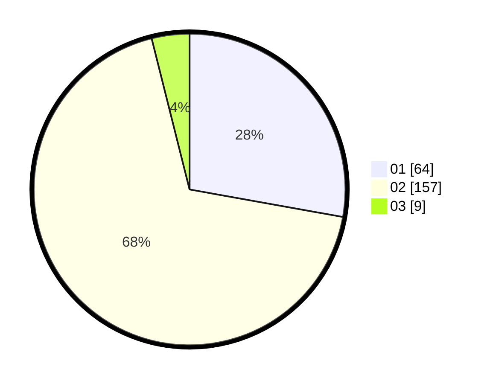

# Hasil

Hasil perolehan suara paslon dapat dilihat pada file paslon-01.txt, paslon-02.txt, dan paslon-03.txt.

Jika tidak ada, artinya data tersebut belum ada pada SIREKAP.

## Perolehan Suara

 * Paslon 01: **64**.
 * Paslon 02: **157**.
 * Paslon 03: **9**.

## Foto C Plano

https://sirekap-obj-formc.kpu.go.id/fd9c/pemilu/ppwp/31/75/06/10/05/3175061005070-20240214-234104--53ebe003-1982-40e7-87f7-1e6e576b0ca1.jpg

https://sirekap-obj-formc.kpu.go.id/fd9c/pemilu/ppwp/31/75/06/10/05/3175061005070-20240214-225353--150f5759-7369-4a04-a87b-201ad46239a8.jpg
