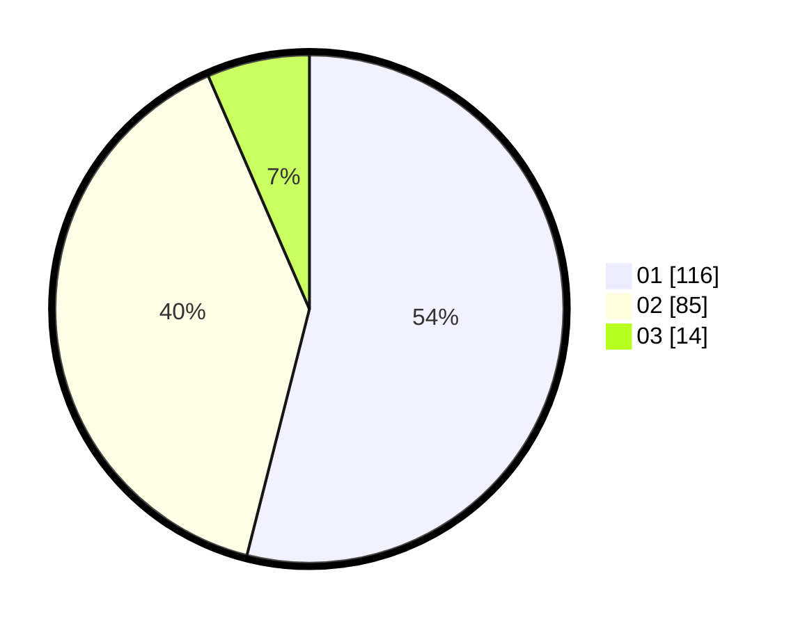

# Hasil

Hasil perolehan suara paslon dapat dilihat pada file paslon-01.txt, paslon-02.txt, dan paslon-03.txt.

Jika tidak ada, artinya data tersebut belum ada pada SIREKAP.

## Perolehan Suara

 * Paslon 01: **116**.
 * Paslon 02: **85**.
 * Paslon 03: **14**.

## Foto C Plano

https://sirekap-obj-formc.kpu.go.id/0287/pemilu/ppwp/31/75/06/10/05/3175061005076-20240214-230740--db6df846-e6dd-4460-b10f-df80cb851ef5.jpg

https://sirekap-obj-formc.kpu.go.id/0287/pemilu/ppwp/31/75/06/10/05/3175061005076-20240214-231121--a761a235-bb20-4bce-a848-ff941a9d02d0.jpg

https://sirekap-obj-formc.kpu.go.id/0287/pemilu/ppwp/31/75/06/10/05/3175061005076-20240214-231200--2b67b32c-b612-4d0e-adbc-bfa47baabb1d.jpg
