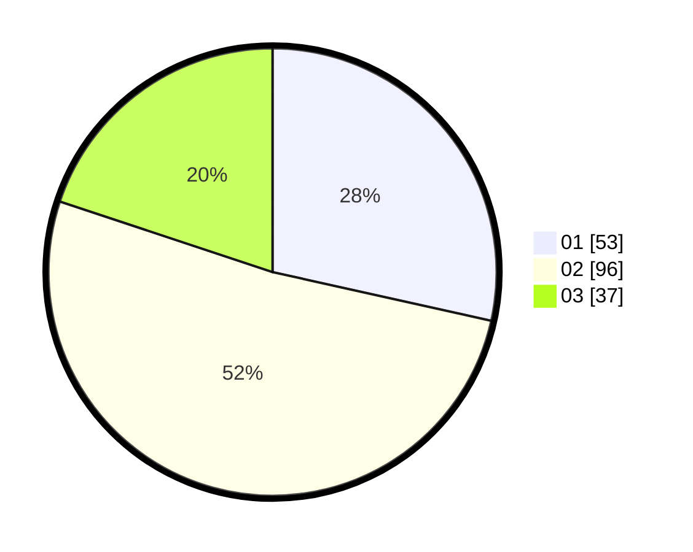

# Hasil

Hasil perolehan suara paslon dapat dilihat pada file paslon-01.txt, paslon-02.txt, dan paslon-03.txt.

Jika tidak ada, artinya data tersebut belum ada pada SIREKAP.

## Perolehan Suara

 * Paslon 01: **53**.
 * Paslon 02: **96**.
 * Paslon 03: **37**.

## Foto C Plano

https://sirekap-obj-formc.kpu.go.id/6fe8/pemilu/ppwp/31/75/06/10/05/3175061005078-20240214-211159--cd56eb6e-856e-43e9-aa81-02832076c0b8.jpg

https://sirekap-obj-formc.kpu.go.id/6fe8/pemilu/ppwp/31/75/06/10/05/3175061005078-20240214-211216--afae5331-2e90-4c65-bc17-8fd723e0ca76.jpg

https://sirekap-obj-formc.kpu.go.id/6fe8/pemilu/ppwp/31/75/06/10/05/3175061005078-20240214-211308--5e4f1ea1-54ee-4ec8-8b66-787e1c522365.jpg
