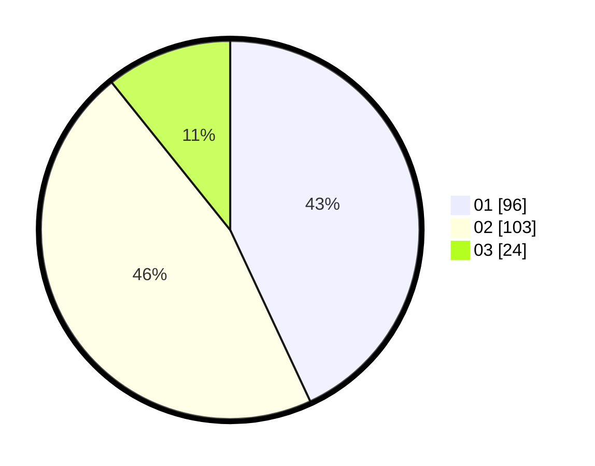

# Hasil

Hasil perolehan suara paslon dapat dilihat pada file paslon-01.txt, paslon-02.txt, dan paslon-03.txt.

Jika tidak ada, artinya data tersebut belum ada pada SIREKAP.

## Perolehan Suara

 * Paslon 01: **96**.
 * Paslon 02: **103**.
 * Paslon 03: **24**.

## Foto C Plano

https://sirekap-obj-formc.kpu.go.id/d677/pemilu/ppwp/31/75/06/10/05/3175061005089-20240214-214130--923b32ae-0b09-44e2-a223-18062a5b4582.jpg

https://sirekap-obj-formc.kpu.go.id/d677/pemilu/ppwp/31/75/06/10/05/3175061005089-20240214-214316--b45168f7-6f87-435c-a4eb-79411f2773a1.jpg

https://sirekap-obj-formc.kpu.go.id/d677/pemilu/ppwp/31/75/06/10/05/3175061005089-20240214-214405--01ca6fa4-d74a-491a-8513-853863551586.jpg

## DATA PEMILIH TETAP

Jumlah pemilih dalam DPT: **275**.
 * L: **136**.
 * P: **139**.

## DATA PENGGUNA HAK PILIH

Jumlah pengguna hak pilih dalam DPT: **225**.
 * L: **110**.
 * P: **115**.

Jumlah pengguna hak pilih dalam DPTb: **1**.
 * L: **1**.
 * P: **0**.

Jumlah pengguna hak pilih dalam DPK: **0**.
 * L: **0**.
 * P: **0**.

Jumlah pengguna hak pilih: **226**.
 * L: **111**.
 * P: **115**.

## JUMLAH SUARA SAH DAN TIDAK SAH

JUMLAH SELURUH SUARA SAH: **223**.

JUMLAH SUARA TIDAK SAH: **3**.

JUMLAH SELURUH SUARA SAH DAN SUARA TIDAK SAH: **226**.
