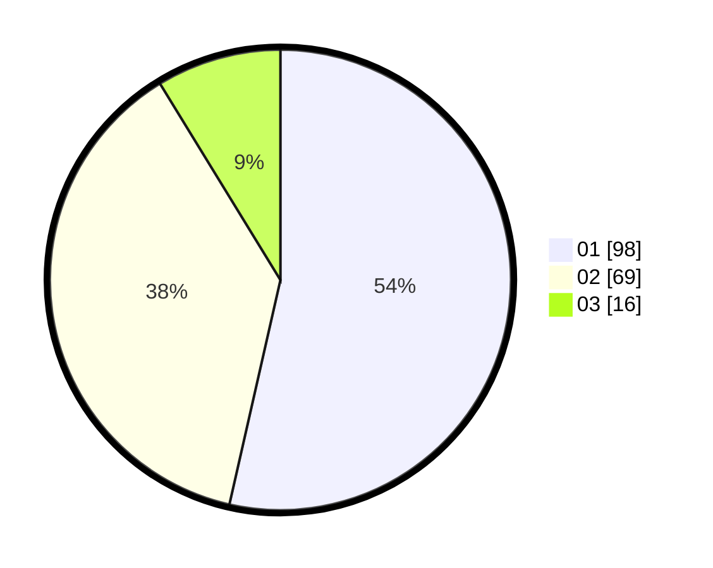

# Hasil

Hasil perolehan suara paslon dapat dilihat pada file paslon-01.txt, paslon-02.txt, dan paslon-03.txt.

Jika tidak ada, artinya data tersebut belum ada pada SIREKAP.

## Perolehan Suara

 * Paslon 01: **98**.
 * Paslon 02: **69**.
 * Paslon 03: **16**.

## Foto C Plano

https://sirekap-obj-formc.kpu.go.id/5d66/pemilu/ppwp/31/75/06/10/05/3175061005097-20240214-221805--c77b4394-70a4-4472-8474-d8ff7ec4df65.jpg

https://sirekap-obj-formc.kpu.go.id/5d66/pemilu/ppwp/31/75/06/10/05/3175061005097-20240214-221837--be6dce83-e26e-4c0e-ad97-2ab75e623a35.jpg

https://sirekap-obj-formc.kpu.go.id/5d66/pemilu/ppwp/31/75/06/10/05/3175061005097-20240214-221907--80b3831c-eae1-43e2-91aa-d040416c232e.jpg
