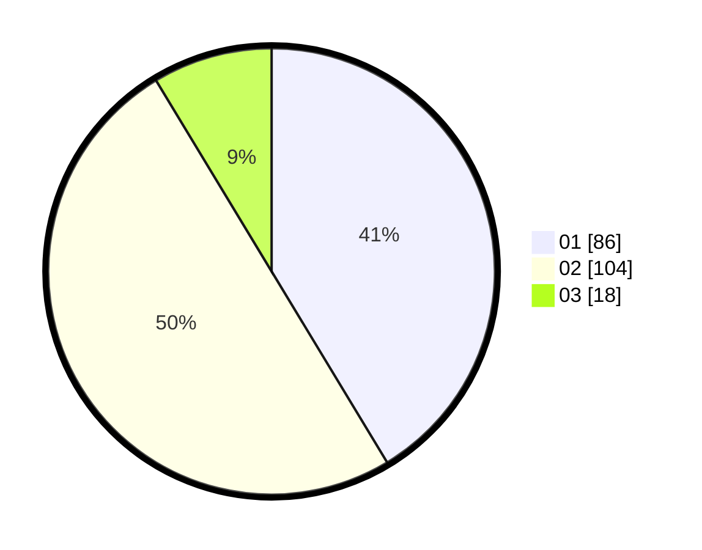

# Hasil

Hasil perolehan suara paslon dapat dilihat pada file paslon-01.txt, paslon-02.txt, dan paslon-03.txt.

Jika tidak ada, artinya data tersebut belum ada pada SIREKAP.

## Perolehan Suara

 * Paslon 01: **86**.
 * Paslon 02: **104**.
 * Paslon 03: **18**.

## Foto C Plano

https://sirekap-obj-formc.kpu.go.id/ca72/pemilu/ppwp/31/75/06/10/05/3175061005098-20240214-220907--d8af578d-cb63-4efc-9488-b3312ce6c71b.jpg

https://sirekap-obj-formc.kpu.go.id/ca72/pemilu/ppwp/31/75/06/10/05/3175061005098-20240214-220925--d52ba2f9-853d-4bff-aa92-8b1bd7e79b11.jpg

https://sirekap-obj-formc.kpu.go.id/ca72/pemilu/ppwp/31/75/06/10/05/3175061005098-20240214-220940--0f58f510-f00f-44af-8514-12d3d2c9147c.jpg
