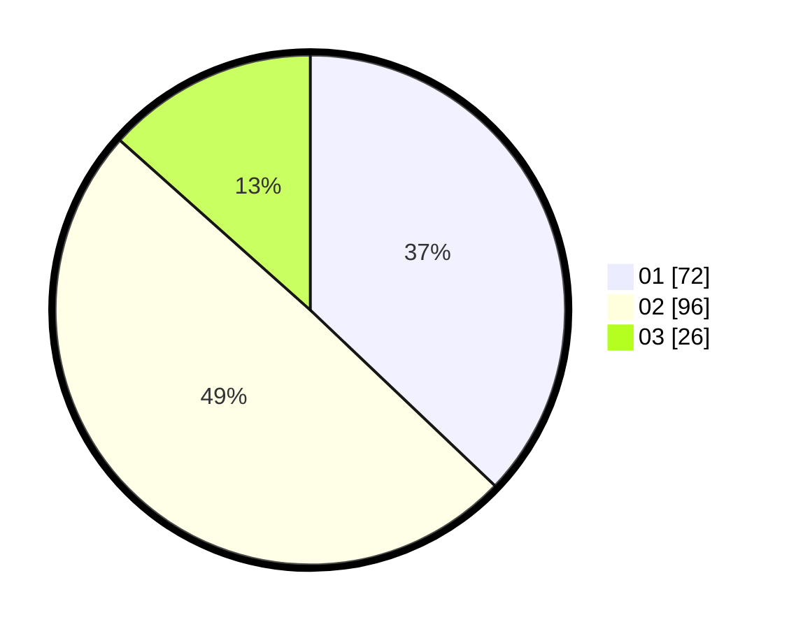

# Hasil

Hasil perolehan suara paslon dapat dilihat pada file paslon-01.txt, paslon-02.txt, dan paslon-03.txt.

Jika tidak ada, artinya data tersebut belum ada pada SIREKAP.

## Perolehan Suara

 * Paslon 01: **72**.
 * Paslon 02: **96**.
 * Paslon 03: **26**.

## Foto C Plano

https://sirekap-obj-formc.kpu.go.id/d5d1/pemilu/ppwp/31/75/06/10/05/3175061005102-20240214-221839--5ac5b18e-f38d-4a7f-8286-8c45f42a36a9.jpg

https://sirekap-obj-formc.kpu.go.id/d5d1/pemilu/ppwp/31/75/06/10/05/3175061005102-20240214-221850--1e9aeecb-55d0-4ced-9dd6-4bed7b5892c1.jpg

https://sirekap-obj-formc.kpu.go.id/d5d1/pemilu/ppwp/31/75/06/10/05/3175061005102-20240214-221859--d3af0707-4b5d-41dc-a6f9-d27f8024afe4.jpg
