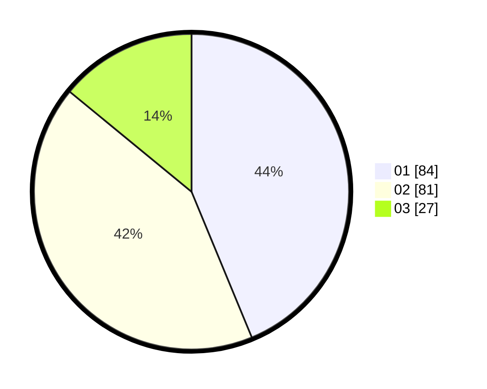

# Hasil

Hasil perolehan suara paslon dapat dilihat pada file paslon-01.txt, paslon-02.txt, dan paslon-03.txt.

Jika tidak ada, artinya data tersebut belum ada pada SIREKAP.

## Perolehan Suara

 * Paslon 01: **84**.
 * Paslon 02: **81**.
 * Paslon 03: **27**.

## Foto C Plano

https://sirekap-obj-formc.kpu.go.id/02f0/pemilu/ppwp/31/75/06/10/05/3175061005105-20240215-090100--31295151-feb9-47c8-b466-67438b7cf8ad.jpg

https://sirekap-obj-formc.kpu.go.id/02f0/pemilu/ppwp/31/75/06/10/05/3175061005105-20240215-090139--4c3ddb1e-1892-4e96-9ffd-fb4bd0003f02.jpg

https://sirekap-obj-formc.kpu.go.id/02f0/pemilu/ppwp/31/75/06/10/05/3175061005105-20240215-090147--fc146867-88d9-4a51-84a7-96b8655cd812.jpg
