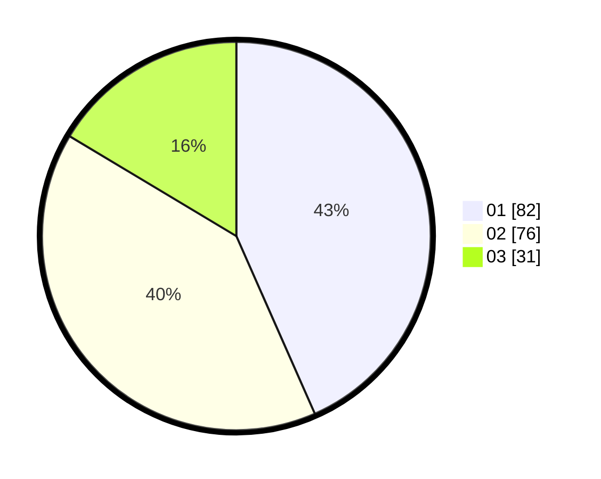

# Hasil

Hasil perolehan suara paslon dapat dilihat pada file paslon-01.txt, paslon-02.txt, dan paslon-03.txt.

Jika tidak ada, artinya data tersebut belum ada pada SIREKAP.

## Perolehan Suara

 * Paslon 01: **82**.
 * Paslon 02: **76**.
 * Paslon 03: **31**.

## Foto C Plano

https://sirekap-obj-formc.kpu.go.id/9ec8/pemilu/ppwp/31/75/06/10/05/3175061005112-20240214-192157--27251af7-a7fb-4c9f-aec6-4b1103119cdc.jpg

https://sirekap-obj-formc.kpu.go.id/9ec8/pemilu/ppwp/31/75/06/10/05/3175061005112-20240214-192221--b05ce8e9-6821-4524-9fb2-64eac014739a.jpg

https://sirekap-obj-formc.kpu.go.id/9ec8/pemilu/ppwp/31/75/06/10/05/3175061005112-20240214-192251--299b784a-8188-4a16-a889-2576f84638f3.jpg
