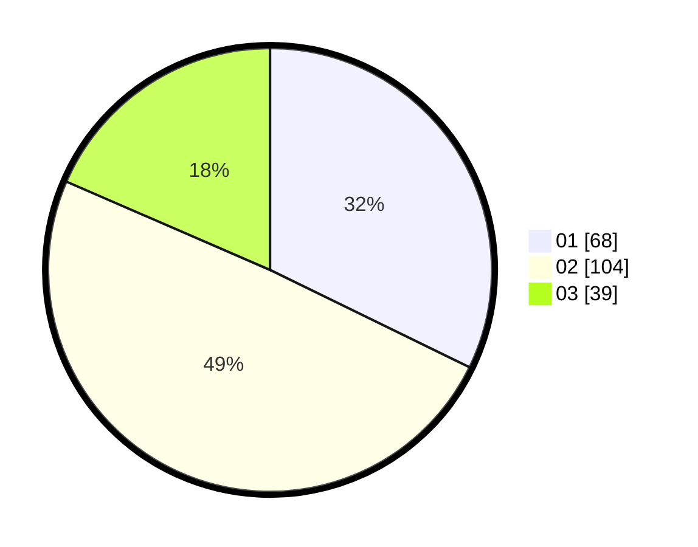

# Hasil

Hasil perolehan suara paslon dapat dilihat pada file paslon-01.txt, paslon-02.txt, dan paslon-03.txt.

Jika tidak ada, artinya data tersebut belum ada pada SIREKAP.

## Perolehan Suara

 * Paslon 01: **68**.
 * Paslon 02: **104**.
 * Paslon 03: **39**.

## Foto C Plano

https://sirekap-obj-formc.kpu.go.id/1b54/pemilu/ppwp/31/75/06/10/05/3175061005117-20240214-225308--57ea9a6f-eb65-4fbb-b04b-76ec320e8cef.jpg

https://sirekap-obj-formc.kpu.go.id/1b54/pemilu/ppwp/31/75/06/10/05/3175061005117-20240214-225409--924fd534-2296-494e-9e5b-5177992aeaee.jpg
