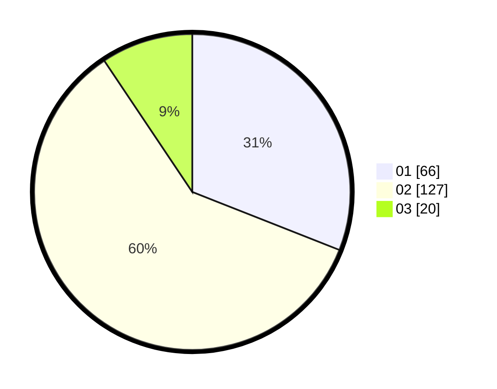

# Hasil

Hasil perolehan suara paslon dapat dilihat pada file paslon-01.txt, paslon-02.txt, dan paslon-03.txt.

Jika tidak ada, artinya data tersebut belum ada pada SIREKAP.

## Perolehan Suara

 * Paslon 01: **66**.
 * Paslon 02: **127**.
 * Paslon 03: **20**.

## Foto C Plano

https://sirekap-obj-formc.kpu.go.id/9863/pemilu/ppwp/31/75/06/10/05/3175061005124-20240214-155154--b600bc31-0ff9-426e-96d0-c8e6f5c4377b.jpg

https://sirekap-obj-formc.kpu.go.id/9863/pemilu/ppwp/31/75/06/10/05/3175061005124-20240214-155149--97db7d68-9476-44bc-97ea-c17d8bc71da7.jpg

https://sirekap-obj-formc.kpu.go.id/9863/pemilu/ppwp/31/75/06/10/05/3175061005124-20240214-155323--82da771e-e36c-4ff4-8eaf-f63c43c28bac.jpg

## DATA PEMILIH TETAP

Jumlah pemilih dalam DPT: **288**.
 * L: **141**.
 * P: **147**.

## DATA PENGGUNA HAK PILIH

Jumlah pengguna hak pilih dalam DPT: **201**.
 * L: **91**.
 * P: **110**.

Jumlah pengguna hak pilih dalam DPTb: **5**.
 * L: **2**.
 * P: **3**.

Jumlah pengguna hak pilih dalam DPK: **9**.
 * L: **4**.
 * P: **5**.

Jumlah pengguna hak pilih: **215**.
 * L: **97**.
 * P: **118**.

## JUMLAH SUARA SAH DAN TIDAK SAH

JUMLAH SELURUH SUARA SAH: **213**.

JUMLAH SUARA TIDAK SAH: **2**.

JUMLAH SELURUH SUARA SAH DAN SUARA TIDAK SAH: **215**.
