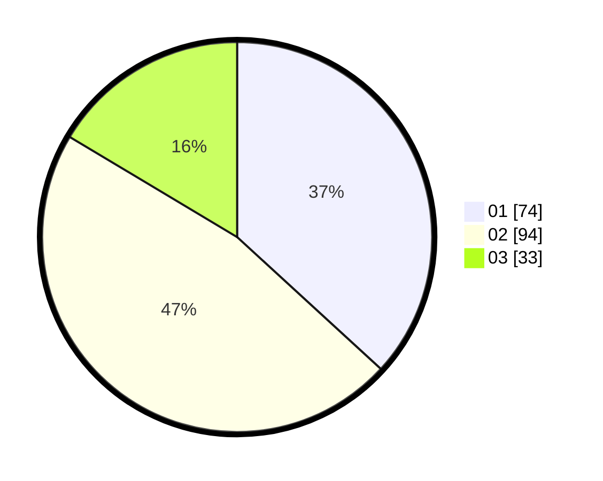

# Hasil

Hasil perolehan suara paslon dapat dilihat pada file paslon-01.txt, paslon-02.txt, dan paslon-03.txt.

Jika tidak ada, artinya data tersebut belum ada pada SIREKAP.

## Perolehan Suara

 * Paslon 01: **74**.
 * Paslon 02: **94**.
 * Paslon 03: **33**.

## Foto C Plano

https://sirekap-obj-formc.kpu.go.id/8fdb/pemilu/ppwp/31/75/06/10/05/3175061005125-20240214-195001--77cc6b55-3854-4aca-a34e-f0460b3c44a7.jpg

https://sirekap-obj-formc.kpu.go.id/8fdb/pemilu/ppwp/31/75/06/10/05/3175061005125-20240214-195035--c3177e71-120b-4e90-bfc3-8ada49a5f132.jpg

https://sirekap-obj-formc.kpu.go.id/8fdb/pemilu/ppwp/31/75/06/10/05/3175061005125-20240214-195113--b3c28f8c-81ae-4fd1-800d-35c50645cbd5.jpg

## DATA PEMILIH TETAP

Jumlah pemilih dalam DPT: **280**.
 * L: **138**.
 * P: **142**.

## DATA PENGGUNA HAK PILIH

Jumlah pengguna hak pilih dalam DPT: **197**.
 * L: **94**.
 * P: **103**.

Jumlah pengguna hak pilih dalam DPTb: **2**.
 * L: **1**.
 * P: **1**.

Jumlah pengguna hak pilih dalam DPK: **3**.
 * L: **1**.
 * P: **2**.

Jumlah pengguna hak pilih: **202**.
 * L: **96**.
 * P: **106**.

## JUMLAH SUARA SAH DAN TIDAK SAH

JUMLAH SELURUH SUARA SAH: **201**.

JUMLAH SUARA TIDAK SAH: **1**.

JUMLAH SELURUH SUARA SAH DAN SUARA TIDAK SAH: **202**.
