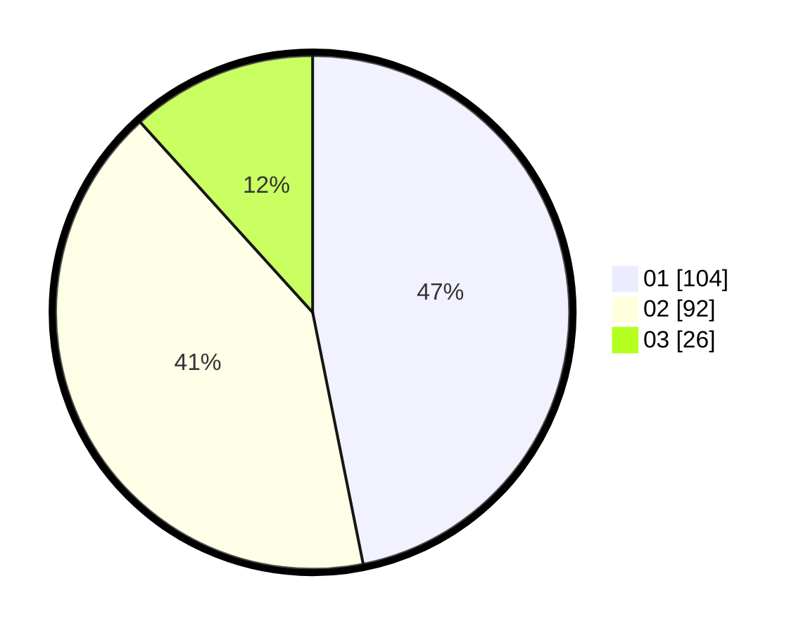

# Hasil

Hasil perolehan suara paslon dapat dilihat pada file paslon-01.txt, paslon-02.txt, dan paslon-03.txt.

Jika tidak ada, artinya data tersebut belum ada pada SIREKAP.

## Perolehan Suara

 * Paslon 01: **104**.
 * Paslon 02: **92**.
 * Paslon 03: **26**.

## Foto C Plano

https://sirekap-obj-formc.kpu.go.id/184a/pemilu/ppwp/31/75/06/10/05/3175061005128-20240215-091624--7d37da3c-0cfa-4197-af89-66a8702b6c3c.jpg

https://sirekap-obj-formc.kpu.go.id/184a/pemilu/ppwp/31/75/06/10/05/3175061005128-20240215-091632--e83912b4-67c2-4816-afbd-0229c7fe239d.jpg

https://sirekap-obj-formc.kpu.go.id/184a/pemilu/ppwp/31/75/06/10/05/3175061005128-20240215-091638--fe61704e-61ad-4394-a64b-58b32d48e96f.jpg
