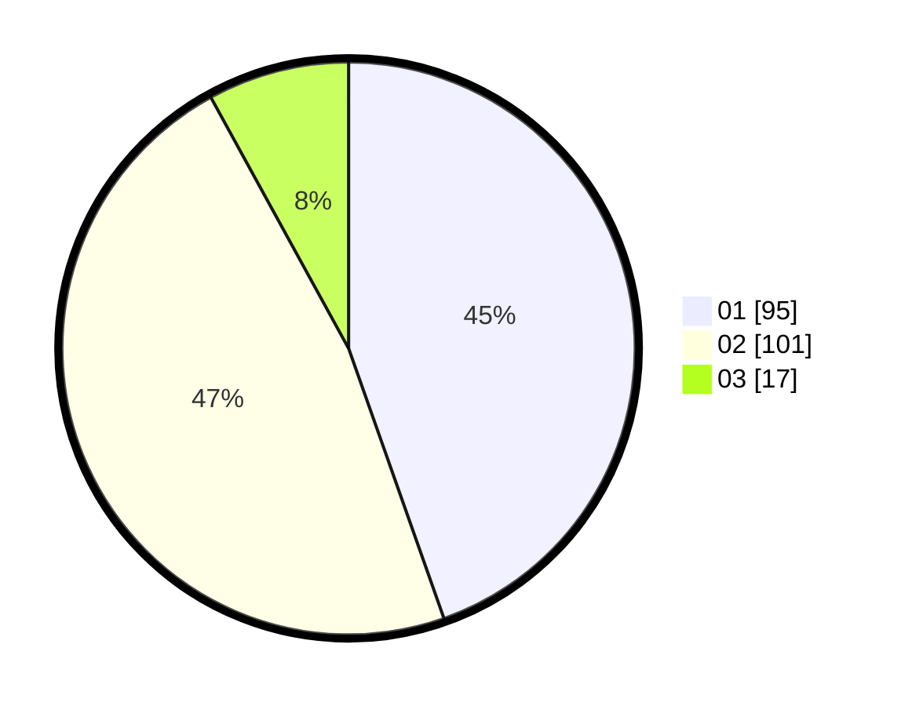

# Hasil

Hasil perolehan suara paslon dapat dilihat pada file paslon-01.txt, paslon-02.txt, dan paslon-03.txt.

Jika tidak ada, artinya data tersebut belum ada pada SIREKAP.

## Perolehan Suara

 * Paslon 01: **95**.
 * Paslon 02: **101**.
 * Paslon 03: **17**.

## Foto C Plano

https://sirekap-obj-formc.kpu.go.id/d1af/pemilu/ppwp/31/75/06/10/05/3175061005134-20240214-223146--76d0f3ee-8a63-4b7f-99a6-1fd558092a0c.jpg

https://sirekap-obj-formc.kpu.go.id/d1af/pemilu/ppwp/31/75/06/10/05/3175061005134-20240214-223223--4c1a4ac3-4e80-47a5-a379-f33d676df23e.jpg

https://sirekap-obj-formc.kpu.go.id/d1af/pemilu/ppwp/31/75/06/10/05/3175061005134-20240214-223247--51b145ff-1a54-4e49-a274-d385898a18ba.jpg
