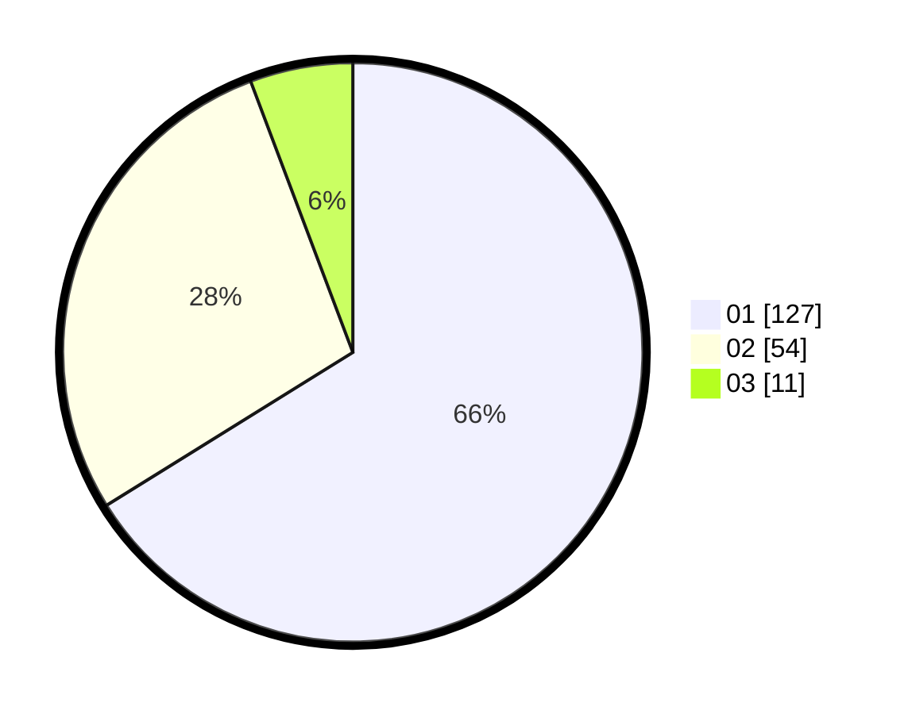

# Hasil

Hasil perolehan suara paslon dapat dilihat pada file paslon-01.txt, paslon-02.txt, dan paslon-03.txt.

Jika tidak ada, artinya data tersebut belum ada pada SIREKAP.

## Perolehan Suara

 * Paslon 01: **127**.
 * Paslon 02: **54**.
 * Paslon 03: **11**.

## Foto C Plano

https://sirekap-obj-formc.kpu.go.id/e98b/pemilu/ppwp/31/75/06/10/05/3175061005144-20240214-202434--43e24d9c-0c90-4d08-987f-b6357f97a218.jpg

https://sirekap-obj-formc.kpu.go.id/e98b/pemilu/ppwp/31/75/06/10/05/3175061005144-20240214-202520--2ff0b711-75e8-467e-86aa-dce07750492d.jpg

https://sirekap-obj-formc.kpu.go.id/e98b/pemilu/ppwp/31/75/06/10/05/3175061005144-20240214-202558--847bffde-2420-46ff-a868-d821fa4c9dc7.jpg

## DATA PEMILIH TETAP

Jumlah pemilih dalam DPT: **236**.
 * L: **115**.
 * P: **121**.

## DATA PENGGUNA HAK PILIH

Jumlah pengguna hak pilih dalam DPT: **193**.
 * L: **91**.
 * P: **102**.

Jumlah pengguna hak pilih dalam DPTb: **0**.
 * L: **0**.
 * P: **0**.

Jumlah pengguna hak pilih dalam DPK: **2**.
 * L: **1**.
 * P: **1**.

Jumlah pengguna hak pilih: **195**.
 * L: **92**.
 * P: **103**.

## JUMLAH SUARA SAH DAN TIDAK SAH

JUMLAH SELURUH SUARA SAH: **192**.

JUMLAH SUARA TIDAK SAH: **3**.

JUMLAH SELURUH SUARA SAH DAN SUARA TIDAK SAH: **195**.
