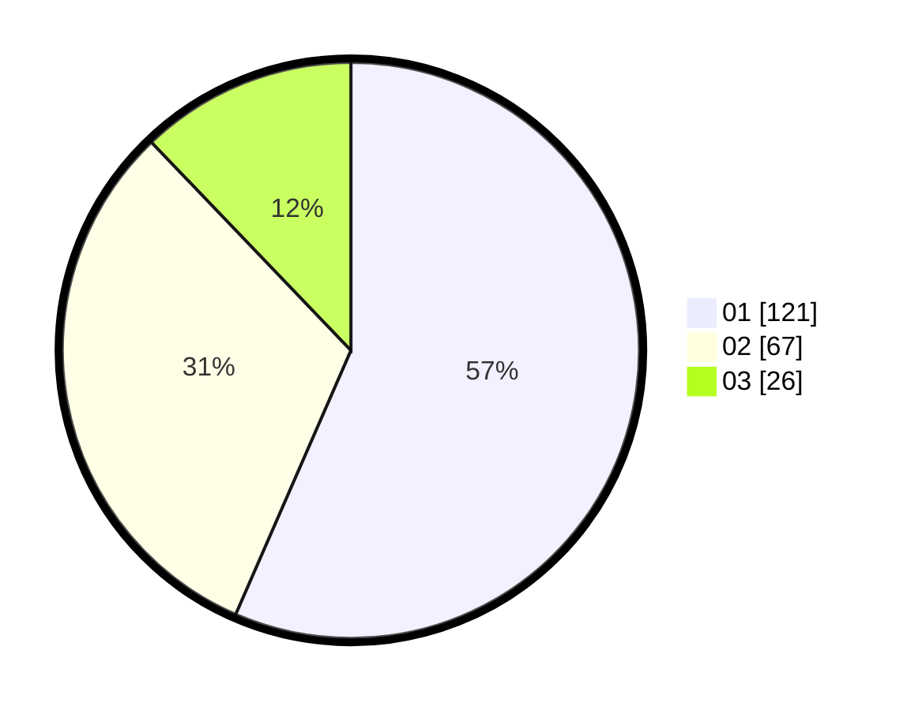

# Hasil

Hasil perolehan suara paslon dapat dilihat pada file paslon-01.txt, paslon-02.txt, dan paslon-03.txt.

Jika tidak ada, artinya data tersebut belum ada pada SIREKAP.

## Perolehan Suara

 * Paslon 01: **121**.
 * Paslon 02: **67**.
 * Paslon 03: **26**.

## Foto C Plano

https://sirekap-obj-formc.kpu.go.id/7b91/pemilu/ppwp/31/75/06/10/05/3175061005146-20240214-212913--65ab4927-3833-439f-8578-7db20c31a409.jpg

https://sirekap-obj-formc.kpu.go.id/7b91/pemilu/ppwp/31/75/06/10/05/3175061005146-20240214-213012--6cf5d49a-1613-4ffe-b86a-5d8044be6733.jpg

https://sirekap-obj-formc.kpu.go.id/7b91/pemilu/ppwp/31/75/06/10/05/3175061005146-20240214-213109--e0b26ed7-782c-45d0-8e2d-d103ed0d34f9.jpg
