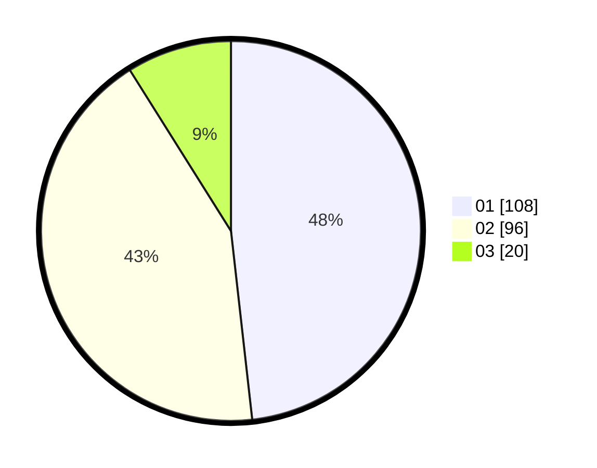

# Hasil

Hasil perolehan suara paslon dapat dilihat pada file paslon-01.txt, paslon-02.txt, dan paslon-03.txt.

Jika tidak ada, artinya data tersebut belum ada pada SIREKAP.

## Perolehan Suara

 * Paslon 01: **108**.
 * Paslon 02: **96**.
 * Paslon 03: **20**.

## Foto C Plano

https://sirekap-obj-formc.kpu.go.id/c3f3/pemilu/ppwp/31/75/06/10/05/3175061005149-20240214-224136--1ce31745-a65e-4b5a-850b-e2b6443774fc.jpg

https://sirekap-obj-formc.kpu.go.id/c3f3/pemilu/ppwp/31/75/06/10/05/3175061005149-20240214-192341--65bc74fb-de89-4d8b-87d8-937be3d4f681.jpg

https://sirekap-obj-formc.kpu.go.id/c3f3/pemilu/ppwp/31/75/06/10/05/3175061005149-20240214-192400--66ee0039-9419-48cd-890b-cfebcf7194dc.jpg
