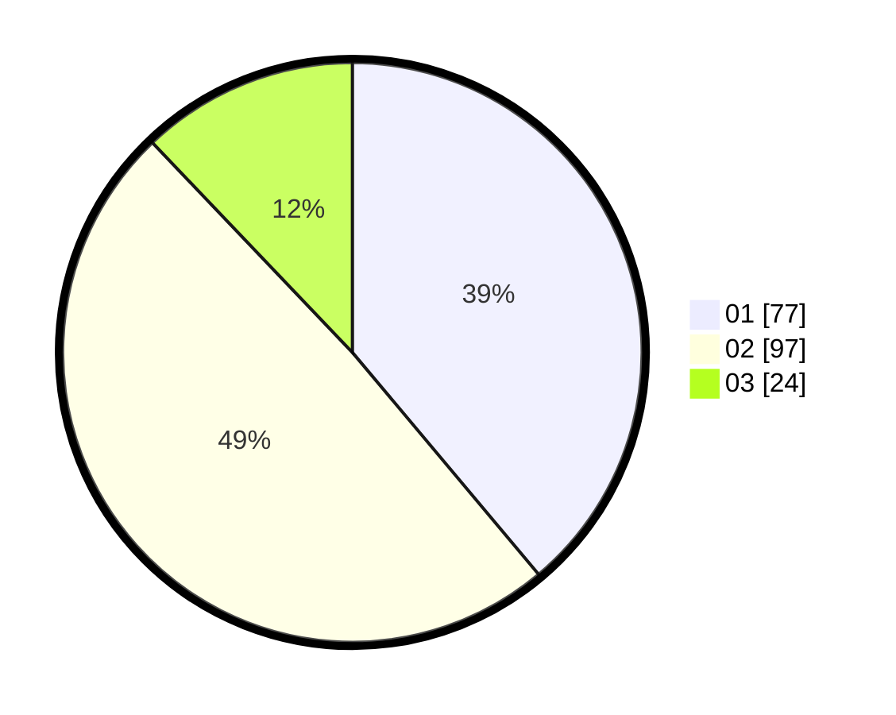

# Hasil

Hasil perolehan suara paslon dapat dilihat pada file paslon-01.txt, paslon-02.txt, dan paslon-03.txt.

Jika tidak ada, artinya data tersebut belum ada pada SIREKAP.

## Perolehan Suara

 * Paslon 01: **77**.
 * Paslon 02: **97**.
 * Paslon 03: **24**.

## Foto C Plano

https://sirekap-obj-formc.kpu.go.id/174d/pemilu/ppwp/31/75/06/10/05/3175061005152-20240214-220401--a9cd0c98-698e-4bd3-b10a-48e48a1d8641.jpg

https://sirekap-obj-formc.kpu.go.id/174d/pemilu/ppwp/31/75/06/10/05/3175061005152-20240214-220726--8bfee35f-28a4-4e40-a0ff-9b6ad7b72652.jpg

https://sirekap-obj-formc.kpu.go.id/174d/pemilu/ppwp/31/75/06/10/05/3175061005152-20240214-220818--31ca8910-15d0-4f47-afb5-e1c1b2db6e00.jpg
