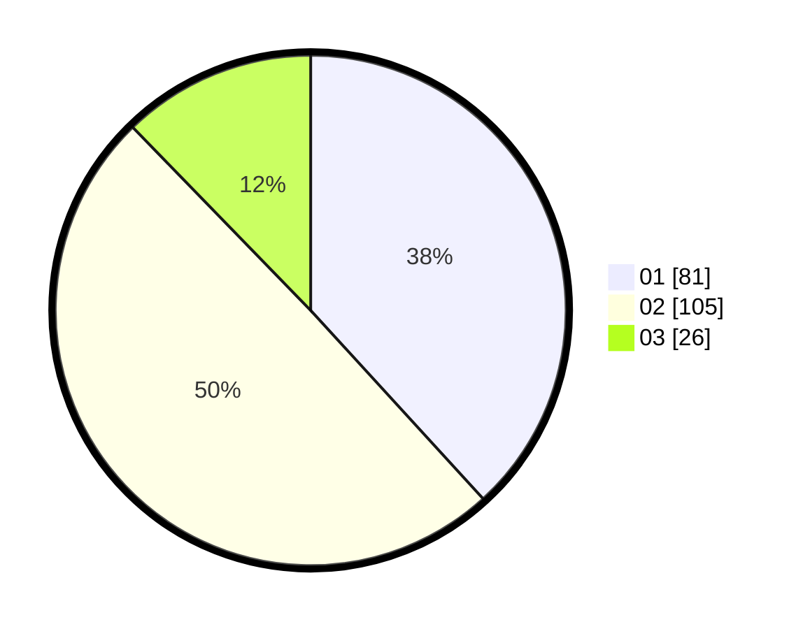

# Hasil

Hasil perolehan suara paslon dapat dilihat pada file paslon-01.txt, paslon-02.txt, dan paslon-03.txt.

Jika tidak ada, artinya data tersebut belum ada pada SIREKAP.

## Perolehan Suara

 * Paslon 01: **81**.
 * Paslon 02: **105**.
 * Paslon 03: **26**.

## Foto C Plano

https://sirekap-obj-formc.kpu.go.id/606e/pemilu/ppwp/31/75/06/10/05/3175061005155-20240214-230032--68a68041-7668-4578-a491-9e085755e7eb.jpg

https://sirekap-obj-formc.kpu.go.id/606e/pemilu/ppwp/31/75/06/10/05/3175061005155-20240214-230146--c184336f-30c2-4d7d-801a-8f12cad9dd58.jpg

https://sirekap-obj-formc.kpu.go.id/606e/pemilu/ppwp/31/75/06/10/05/3175061005155-20240214-230205--ab51d295-706e-483e-b20a-7717968d857f.jpg
