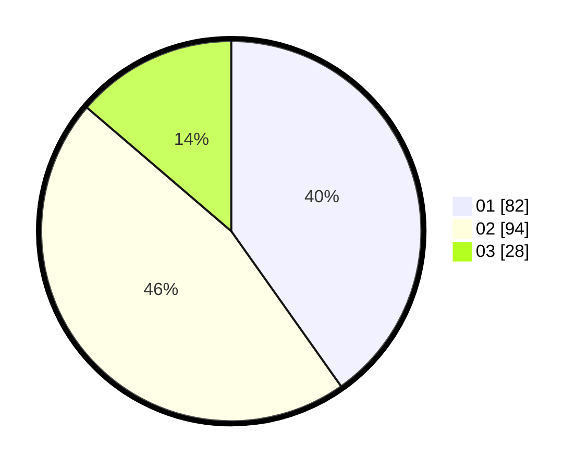

# Hasil

Hasil perolehan suara paslon dapat dilihat pada file paslon-01.txt, paslon-02.txt, dan paslon-03.txt.

Jika tidak ada, artinya data tersebut belum ada pada SIREKAP.

## Perolehan Suara

 * Paslon 01: **82**.
 * Paslon 02: **94**.
 * Paslon 03: **28**.

## Foto C Plano

https://sirekap-obj-formc.kpu.go.id/76bf/pemilu/ppwp/31/75/06/10/05/3175061005156-20240214-234228--789e1d19-958d-4689-af1d-3b821c5f8500.jpg

https://sirekap-obj-formc.kpu.go.id/76bf/pemilu/ppwp/31/75/06/10/05/3175061005156-20240214-234539--1d912661-d14c-4adb-9f6a-724c96ba783b.jpg

https://sirekap-obj-formc.kpu.go.id/76bf/pemilu/ppwp/31/75/06/10/05/3175061005156-20240214-234637--a8375dc4-5bcf-44db-aefd-289acf3fc5fa.jpg
