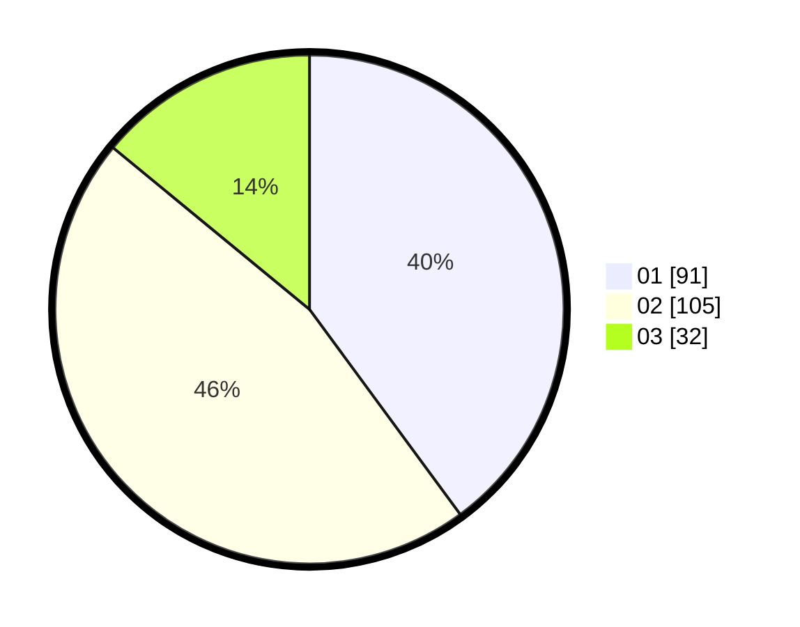

# Hasil

Hasil perolehan suara paslon dapat dilihat pada file paslon-01.txt, paslon-02.txt, dan paslon-03.txt.

Jika tidak ada, artinya data tersebut belum ada pada SIREKAP.

## Perolehan Suara

 * Paslon 01: **91**.
 * Paslon 02: **105**.
 * Paslon 03: **32**.

## Foto C Plano

https://sirekap-obj-formc.kpu.go.id/0d1a/pemilu/ppwp/31/75/06/10/05/3175061005157-20240214-222117--d7599064-52f4-42ab-b7ed-2473c0699b94.jpg

https://sirekap-obj-formc.kpu.go.id/0d1a/pemilu/ppwp/31/75/06/10/05/3175061005157-20240214-222532--565a52c3-f899-4a70-bddf-d6dc0fe58429.jpg

https://sirekap-obj-formc.kpu.go.id/0d1a/pemilu/ppwp/31/75/06/10/05/3175061005157-20240214-222741--66733313-52d3-415a-8538-bbc7fecdeccf.jpg
