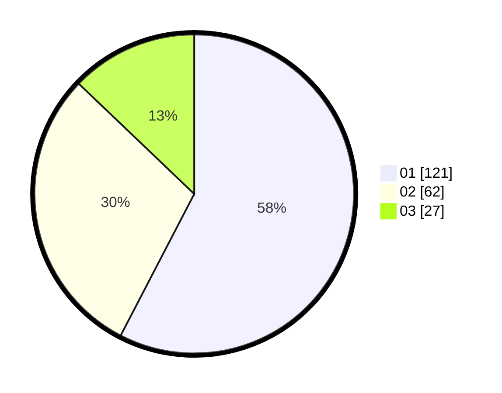

# Hasil

Hasil perolehan suara paslon dapat dilihat pada file paslon-01.txt, paslon-02.txt, dan paslon-03.txt.

Jika tidak ada, artinya data tersebut belum ada pada SIREKAP.

## Perolehan Suara

 * Paslon 01: **121**.
 * Paslon 02: **62**.
 * Paslon 03: **27**.

## Foto C Plano

https://sirekap-obj-formc.kpu.go.id/6932/pemilu/ppwp/31/75/06/10/05/3175061005166-20240214-234930--ba474da9-f2fc-4f31-b9d5-ef3b3f768178.jpg

https://sirekap-obj-formc.kpu.go.id/6932/pemilu/ppwp/31/75/06/10/05/3175061005166-20240214-235106--71ea8323-0d01-42a6-801f-b343269e2baf.jpg

https://sirekap-obj-formc.kpu.go.id/6932/pemilu/ppwp/31/75/06/10/05/3175061005166-20240215-021135--508511ff-45d3-44e4-9209-5cd6ea9daade.jpg
