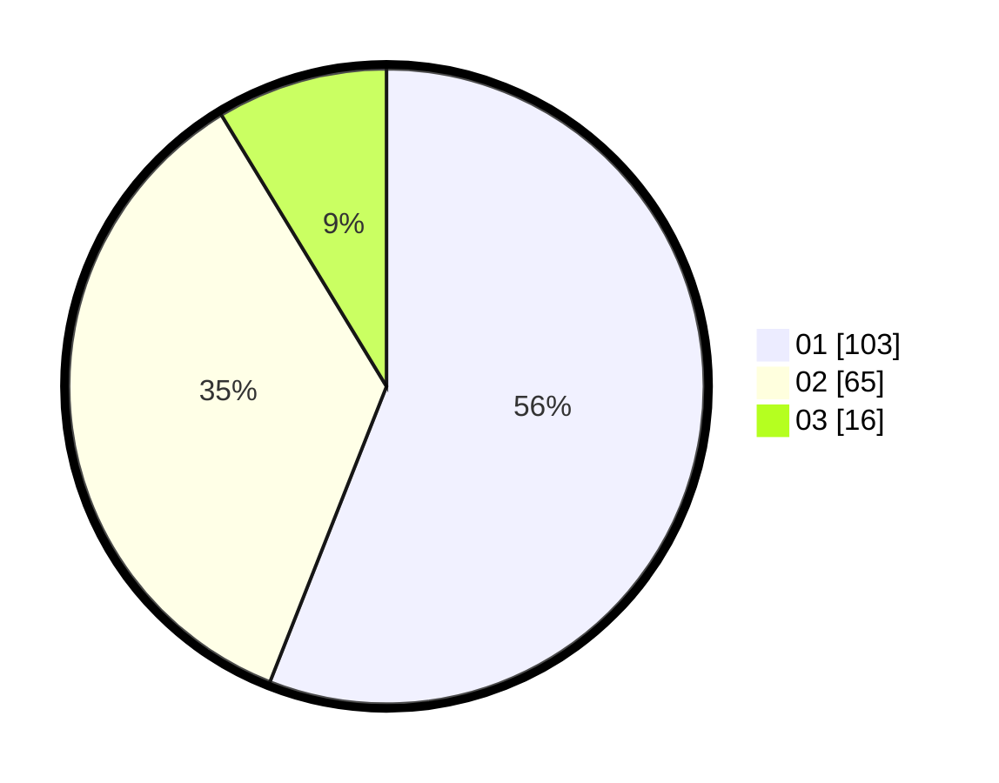

# Hasil

Hasil perolehan suara paslon dapat dilihat pada file paslon-01.txt, paslon-02.txt, dan paslon-03.txt.

Jika tidak ada, artinya data tersebut belum ada pada SIREKAP.

## Perolehan Suara

 * Paslon 01: **103**.
 * Paslon 02: **65**.
 * Paslon 03: **16**.

## Foto C Plano

https://sirekap-obj-formc.kpu.go.id/fd9d/pemilu/ppwp/31/75/06/10/05/3175061005171-20240214-190257--c96ff273-f5c7-4983-be87-85b4fcc72716.jpg

https://sirekap-obj-formc.kpu.go.id/fd9d/pemilu/ppwp/31/75/06/10/05/3175061005171-20240214-155822--2844c427-4c95-4789-bbfb-421b474239f8.jpg

https://sirekap-obj-formc.kpu.go.id/fd9d/pemilu/ppwp/31/75/06/10/05/3175061005171-20240214-155827--bdc3f075-994b-4cac-be8d-1d01d61b8980.jpg

## DATA PEMILIH TETAP

Jumlah pemilih dalam DPT: **258**.
 * L: **126**.
 * P: **132**.

## DATA PENGGUNA HAK PILIH

Jumlah pengguna hak pilih dalam DPT: **186**.
 * L: **91**.
 * P: **95**.

Jumlah pengguna hak pilih dalam DPTb: **0**.
 * L: **0**.
 * P: **0**.

Jumlah pengguna hak pilih dalam DPK: **1**.
 * L: **0**.
 * P: **1**.

Jumlah pengguna hak pilih: **187**.
 * L: **91**.
 * P: **96**.

## JUMLAH SUARA SAH DAN TIDAK SAH

JUMLAH SELURUH SUARA SAH: **184**.

JUMLAH SUARA TIDAK SAH: **3**.

JUMLAH SELURUH SUARA SAH DAN SUARA TIDAK SAH: **187**.
