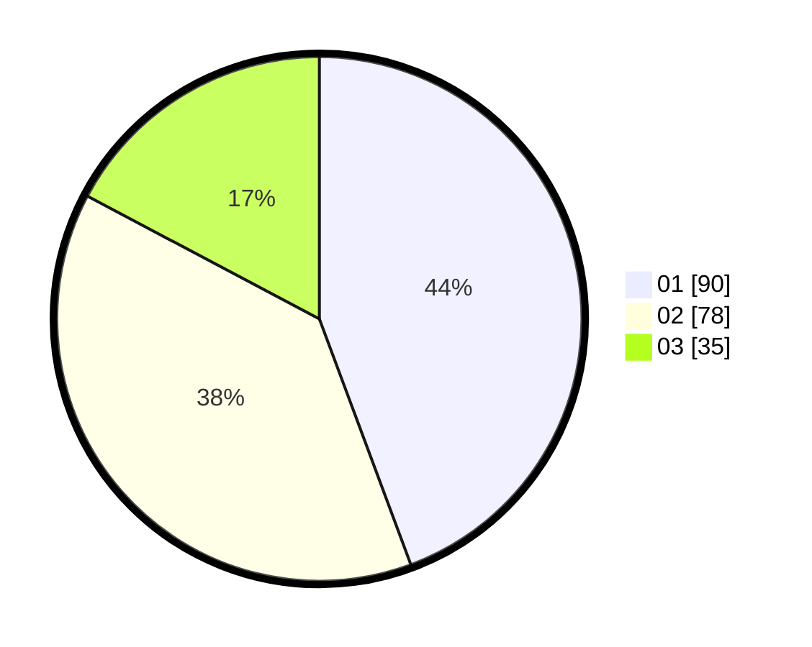

# Hasil

Hasil perolehan suara paslon dapat dilihat pada file paslon-01.txt, paslon-02.txt, dan paslon-03.txt.

Jika tidak ada, artinya data tersebut belum ada pada SIREKAP.

## Perolehan Suara

 * Paslon 01: **90**.
 * Paslon 02: **78**.
 * Paslon 03: **35**.

## Foto C Plano

https://sirekap-obj-formc.kpu.go.id/05ce/pemilu/ppwp/31/75/06/10/05/3175061005174-20240214-193744--1c85ef6f-ce67-45c2-899a-88b895d167a6.jpg

https://sirekap-obj-formc.kpu.go.id/05ce/pemilu/ppwp/31/75/06/10/05/3175061005174-20240214-200336--7202c242-19b3-4ac2-8d20-b9f39fd75965.jpg

https://sirekap-obj-formc.kpu.go.id/05ce/pemilu/ppwp/31/75/06/10/05/3175061005174-20240214-194619--88d85190-e37c-44b0-bff9-d36ccab547bd.jpg
