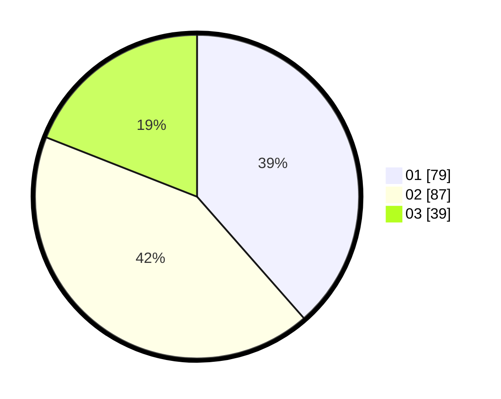

# Hasil

Hasil perolehan suara paslon dapat dilihat pada file paslon-01.txt, paslon-02.txt, dan paslon-03.txt.

Jika tidak ada, artinya data tersebut belum ada pada SIREKAP.

## Perolehan Suara

 * Paslon 01: **79**.
 * Paslon 02: **87**.
 * Paslon 03: **39**.

## Foto C Plano

https://sirekap-obj-formc.kpu.go.id/f07b/pemilu/ppwp/31/75/06/10/05/3175061005176-20240215-205327--dfc03513-7c1d-434a-97ce-e53605e76169.jpg

https://sirekap-obj-formc.kpu.go.id/f07b/pemilu/ppwp/31/75/06/10/05/3175061005176-20240215-205330--fe8d985a-8735-4223-9ee7-03fd63b049d6.jpg

https://sirekap-obj-formc.kpu.go.id/f07b/pemilu/ppwp/31/75/06/10/05/3175061005176-20240215-205329--5a521a80-1fad-4107-823d-65e3ff439a0e.jpg

## DATA PEMILIH TETAP

Jumlah pemilih dalam DPT: **251**.
 * L: **126**.
 * P: **125**.

## DATA PENGGUNA HAK PILIH

Jumlah pengguna hak pilih dalam DPT: **205**.
 * L: **100**.
 * P: **105**.

Jumlah pengguna hak pilih dalam DPTb: **0**.
 * L: **0**.
 * P: **0**.

Jumlah pengguna hak pilih dalam DPK: **5**.
 * L: **1**.
 * P: **4**.

Jumlah pengguna hak pilih: **210**.
 * L: **101**.
 * P: **109**.

## JUMLAH SUARA SAH DAN TIDAK SAH

JUMLAH SELURUH SUARA SAH: **205**.

JUMLAH SUARA TIDAK SAH: **5**.

JUMLAH SELURUH SUARA SAH DAN SUARA TIDAK SAH: **210**.
