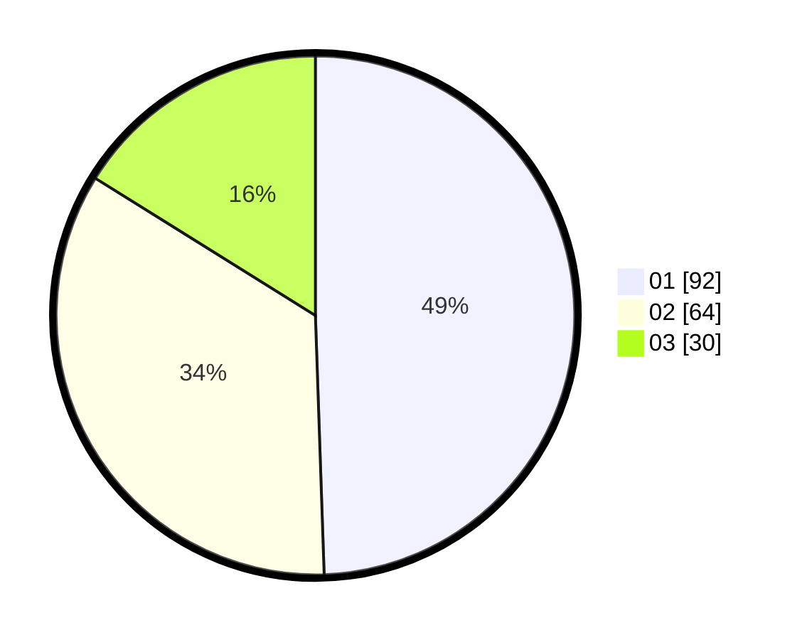

# Hasil

Hasil perolehan suara paslon dapat dilihat pada file paslon-01.txt, paslon-02.txt, dan paslon-03.txt.

Jika tidak ada, artinya data tersebut belum ada pada SIREKAP.

## Perolehan Suara

 * Paslon 01: **92**.
 * Paslon 02: **64**.
 * Paslon 03: **30**.

## Foto C Plano

https://sirekap-obj-formc.kpu.go.id/bae2/pemilu/ppwp/31/75/06/10/05/3175061005179-20240214-223152--0bb2d9d4-6b3c-4e49-8c55-9df4d62f0708.jpg

https://sirekap-obj-formc.kpu.go.id/bae2/pemilu/ppwp/31/75/06/10/05/3175061005179-20240214-223501--0742d7f1-e168-458f-9f2d-094e0aa0d19b.jpg

https://sirekap-obj-formc.kpu.go.id/bae2/pemilu/ppwp/31/75/06/10/05/3175061005179-20240214-223655--f7b048a2-0acb-4ea8-ac41-25efae6eb787.jpg
