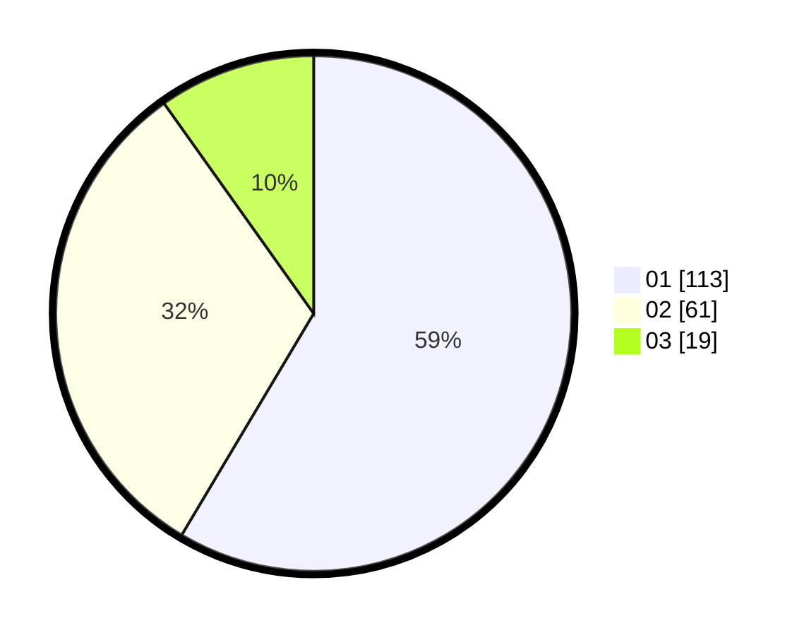

# Hasil

Hasil perolehan suara paslon dapat dilihat pada file paslon-01.txt, paslon-02.txt, dan paslon-03.txt.

Jika tidak ada, artinya data tersebut belum ada pada SIREKAP.

## Perolehan Suara

 * Paslon 01: **113**.
 * Paslon 02: **61**.
 * Paslon 03: **19**.

## Foto C Plano

https://sirekap-obj-formc.kpu.go.id/49e1/pemilu/ppwp/31/75/06/10/05/3175061005183-20240214-155213--9c35ba97-c5f6-4569-83f3-bb3448698765.jpg

https://sirekap-obj-formc.kpu.go.id/49e1/pemilu/ppwp/31/75/06/10/05/3175061005183-20240214-193137--6a39aa3d-425a-414f-9a28-ed5cbcee1552.jpg

https://sirekap-obj-formc.kpu.go.id/49e1/pemilu/ppwp/31/75/06/10/05/3175061005183-20240214-194120--19cb4236-a159-497b-a485-be7177d6f01d.jpg

## DATA PEMILIH TETAP

Jumlah pemilih dalam DPT: **230**.
 * L: **113**.
 * P: **117**.

## DATA PENGGUNA HAK PILIH

Jumlah pengguna hak pilih dalam DPT: **192**.
 * L: **88**.
 * P: **104**.

Jumlah pengguna hak pilih dalam DPTb: **0**.
 * L: **0**.
 * P: **0**.

Jumlah pengguna hak pilih dalam DPK: **3**.
 * L: **1**.
 * P: **2**.

Jumlah pengguna hak pilih: **195**.
 * L: **89**.
 * P: **106**.

## JUMLAH SUARA SAH DAN TIDAK SAH

JUMLAH SELURUH SUARA SAH: **193**.

JUMLAH SUARA TIDAK SAH: **2**.

JUMLAH SELURUH SUARA SAH DAN SUARA TIDAK SAH: **195**.
