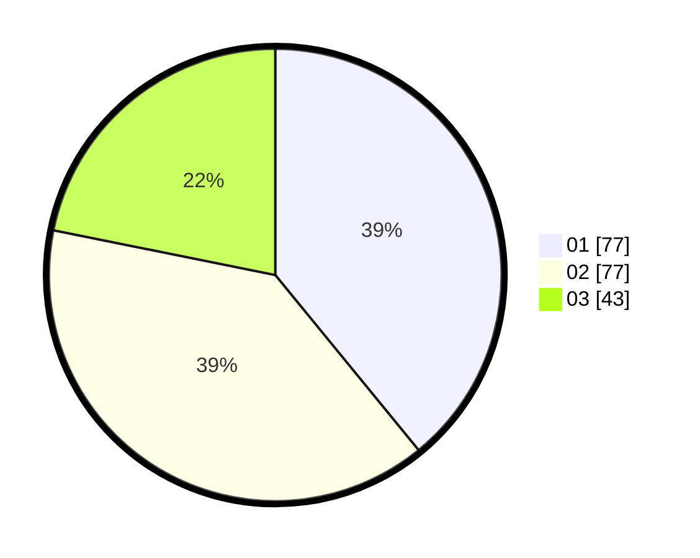

# Hasil

Hasil perolehan suara paslon dapat dilihat pada file paslon-01.txt, paslon-02.txt, dan paslon-03.txt.

Jika tidak ada, artinya data tersebut belum ada pada SIREKAP.

## Perolehan Suara

 * Paslon 01: **77**.
 * Paslon 02: **77**.
 * Paslon 03: **43**.

## Foto C Plano

https://sirekap-obj-formc.kpu.go.id/7277/pemilu/ppwp/31/75/06/10/05/3175061005184-20240214-221658--68b7df6a-b66f-4e32-9297-cee35b7f4158.jpg

https://sirekap-obj-formc.kpu.go.id/7277/pemilu/ppwp/31/75/06/10/05/3175061005184-20240214-221815--51aa89a2-8a1a-4a68-ae4e-19df9cd6f15a.jpg

https://sirekap-obj-formc.kpu.go.id/7277/pemilu/ppwp/31/75/06/10/05/3175061005184-20240214-221906--85e14e90-eccc-4ac3-8e2b-c181c1cd6d6e.jpg
