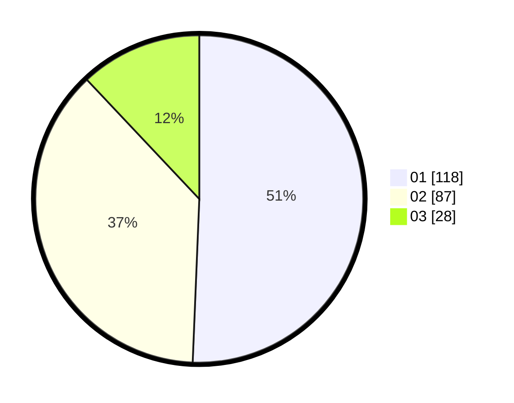

# Hasil

Hasil perolehan suara paslon dapat dilihat pada file paslon-01.txt, paslon-02.txt, dan paslon-03.txt.

Jika tidak ada, artinya data tersebut belum ada pada SIREKAP.

## Perolehan Suara

 * Paslon 01: **118**.
 * Paslon 02: **87**.
 * Paslon 03: **28**.

## Foto C Plano

https://sirekap-obj-formc.kpu.go.id/f017/pemilu/ppwp/31/75/06/10/05/3175061005186-20240215-023437--727fba56-68c5-4a6c-9628-aeb9fd3ad68e.jpg

https://sirekap-obj-formc.kpu.go.id/f017/pemilu/ppwp/31/75/06/10/05/3175061005186-20240215-023438--b4ed311d-c0ae-43b6-a12c-ff206b000d16.jpg

https://sirekap-obj-formc.kpu.go.id/f017/pemilu/ppwp/31/75/06/10/05/3175061005186-20240215-023437--034d6c5f-f582-4983-9fed-c43c16045925.jpg

## DATA PEMILIH TETAP

Jumlah pemilih dalam DPT: **278**.
 * L: **145**.
 * P: **133**.

## DATA PENGGUNA HAK PILIH

Jumlah pengguna hak pilih dalam DPT: **228**.
 * L: **117**.
 * P: **111**.

Jumlah pengguna hak pilih dalam DPTb: **5**.
 * L: **3**.
 * P: **2**.

Jumlah pengguna hak pilih dalam DPK: **6**.
 * L: **3**.
 * P: **3**.

Jumlah pengguna hak pilih: **239**.
 * L: **123**.
 * P: **116**.

## JUMLAH SUARA SAH DAN TIDAK SAH

JUMLAH SELURUH SUARA SAH: **233**.

JUMLAH SUARA TIDAK SAH: **6**.

JUMLAH SELURUH SUARA SAH DAN SUARA TIDAK SAH: **239**.
