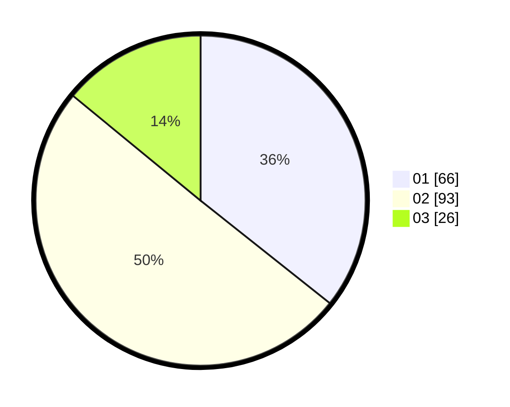

# Hasil

Hasil perolehan suara paslon dapat dilihat pada file paslon-01.txt, paslon-02.txt, dan paslon-03.txt.

Jika tidak ada, artinya data tersebut belum ada pada SIREKAP.

## Perolehan Suara

 * Paslon 01: **66**.
 * Paslon 02: **93**.
 * Paslon 03: **26**.

## Foto C Plano

https://sirekap-obj-formc.kpu.go.id/d776/pemilu/ppwp/31/75/06/10/05/3175061005190-20240214-185050--1677218b-c031-4d89-95ed-ed0e57011d60.jpg

https://sirekap-obj-formc.kpu.go.id/d776/pemilu/ppwp/31/75/06/10/05/3175061005190-20240214-191057--f5250dca-0d59-4806-9844-748dee09d8f2.jpg

https://sirekap-obj-formc.kpu.go.id/d776/pemilu/ppwp/31/75/06/10/05/3175061005190-20240214-190203--9e3888f2-eee5-4c2c-8096-b56fb9619c5d.jpg

## DATA PEMILIH TETAP

Jumlah pemilih dalam DPT: **219**.
 * L: **115**.
 * P: **104**.

## DATA PENGGUNA HAK PILIH

Jumlah pengguna hak pilih dalam DPT: **180**.
 * L: **92**.
 * P: **88**.

Jumlah pengguna hak pilih dalam DPTb: **5**.
 * L: **2**.
 * P: **3**.

Jumlah pengguna hak pilih dalam DPK: **2**.
 * L: **1**.
 * P: **1**.

Jumlah pengguna hak pilih: **187**.
 * L: **95**.
 * P: **92**.

## JUMLAH SUARA SAH DAN TIDAK SAH

JUMLAH SELURUH SUARA SAH: **185**.

JUMLAH SUARA TIDAK SAH: **2**.

JUMLAH SELURUH SUARA SAH DAN SUARA TIDAK SAH: **187**.
